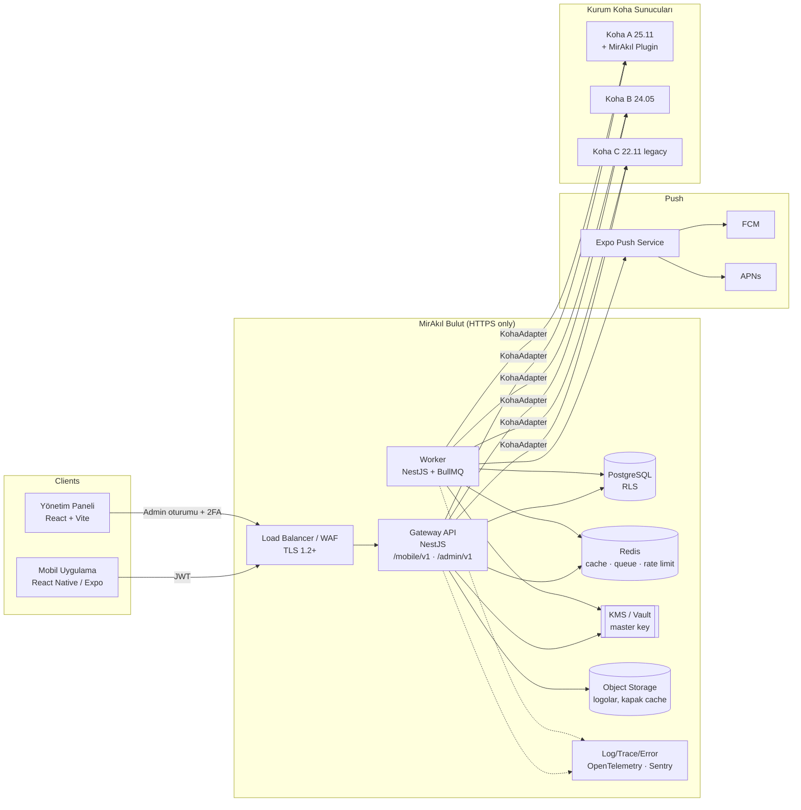
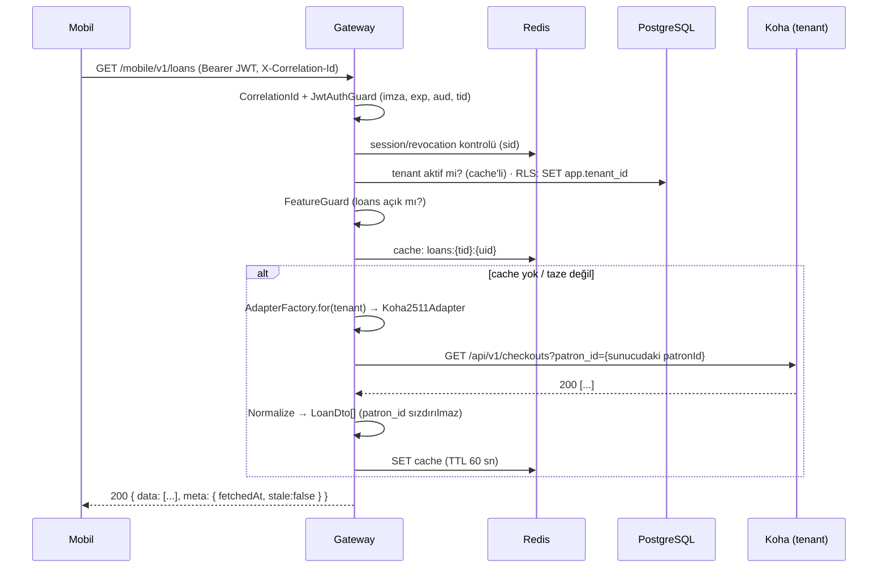

# ARCHITECTURE — Koha Mobile (çalışma adı: MirAkıl Kütüphane)

> Durum: **Taslak v0.1 — mimari doğrulama aşaması.** Bu doküman kod yazılmadan önce
> gereksinim analizini, tespit edilen eksikleri ve önerilen sistem mimarisini içerir.
> İlgili dokümanlar: [DATABASE.md](./DATABASE.md) · [API.md](./API.md) ·
> [KOHA_INTEGRATION.md](./KOHA_INTEGRATION.md) · [AUTHENTICATION.md](./AUTHENTICATION.md) ·
> [NOTIFICATIONS.md](./NOTIFICATIONS.md) · [MVP_PLAN.md](./MVP_PLAN.md)

---

## 1. Gereksinim Analizi (Özet)

| Alan | Gereksinim | Mimari karşılığı |
|---|---|---|
| Platform | iOS + Android, tek uygulama | React Native + Expo (EAS Build), Expo Router |
| Çoklu kurum | Tek uygulama, N bağımsız Koha | Merkezi **Gateway API** + tenant registry + Koha adapter katmanı |
| Kurum seçimi | İlk açılışta seçim, cihazda saklama, "Kurum Değiştir" | `GET /mobile/v1/tenants` + `expo-secure-store` |
| White-label | Logo, renkler, kurum adı; MirAkıl markası korunur | Runtime theming (tenant config), statik uygulama kabuğu |
| Kimlik doğrulama | KOHA (MVP), LDAP/SAML/OIDC (gelecek) | `AuthProvider` strateji arayüzü, kendi JWT + refresh token rotasyonu |
| Koha sürüm farkları | 24.05 / 25.11 / legacy | `KohaAdapter` arayüzü + **yetenek (capability) tespiti** |
| Güvenlik | Tenant izolasyonu, rate limit, şifreli secret, audit, correlation ID | NestJS guard'ları, PostgreSQL RLS, envelope encryption, OpenTelemetry |
| Bildirim | Push (FCM/APNs), tercihler, tekrarsız bildirim | BullMQ worker'lar, dedupe anahtarı (unique index), PushProvider |
| Offline | Son görüntülenen veriler cache'ten; yazma işlemleri yalnızca online | TanStack Query persist (MMKV) + NetInfo tabanlı mutasyon kilidi |
| Yönetim | MirAkıl yönetici paneli | Ayrı web uygulaması (`apps/admin`), `/admin/v1` API |
| Dil | Türkçe ana dil, İngilizce i18n | i18next + `packages/i18n`, backend hata kodları dil-bağımsız |

---

## 2. Tespit Edilen Eksikler ve Açık Noktalar

Aşağıdaki maddeler gereksinimlerde yer almıyor veya netleştirilmesi gerekiyor. Her birine bir
**öneri** ekledim; onaylarsanız tasarıma dahil edilmiş kabul edeceğim.

### 2.1 Koha tarafı ile ilgili kritik eksikler

1. **Katalog araması Koha REST API'de yok.** Koha core REST API (`/api/v1`) Zebra/Elasticsearch
   tam metin aramasını sunmaz; `GET /biblios` yalnızca tablo kolonlarında filtreleme yapar.
   → **Öneri:** MirAkıl tarafından geliştirilecek bir **Koha Plugin** (`/api/v1/contrib/mirakil/...`)
   ile `Koha::SearchEngine` üzerinden arama. Plugin kurulamayan kurumlar için SRU (Zebra) veya
   OPAC OpenSearch/RSS fallback. Ayrıntı: [KOHA_INTEGRATION.md](./KOHA_INTEGRATION.md#5-katalog-araması).
2. **Kütüphane çalışma saatleri, duyurular, geçmiş rezervasyonlar** core REST API'de ya yok ya da
   sürüme göre değişiyor. → **Öneri:** Çalışma saatleri ve duyurular **Gateway'in kendi
   veritabanında** yönetilsin (yönetim paneli), Koha'dan yalnızca şube adres/iletişim bilgisi gelsin.
3. **Kurum Koha sunucularının erişilebilirliği.** Birçok üniversitede Koha kampüs ağı içindedir.
   → **Öneri:** Gateway'in sabit çıkış IP'leri olsun; kurumlar bu IP'leri allowlist'e eklesin.
   Erişim mümkün değilse ileride kurum içine kurulan hafif bir **"MirAkıl Connector"** (outbound
   tünel) seçeneği. MVP'de yalnızca IP allowlist.
4. **Koha servis hesabı (API client) yetkileri.** Gateway, her kurum için Koha'da yetkileri
   sınırlandırılmış bir personel hesabına bağlı OAuth2 client kullanacak. Bu hesap teorik olarak
   kurumun tüm üyelerini görebilir; bu nedenle **patron_id hiçbir zaman istemciden alınmaz**
   (bkz. §6). Kurumlara verilecek "minimum yetki listesi" dokümante edilmeli.
5. **MARC21 / UNIMARC farkı.** Türkiye'de bazı kurumlar UNIMARC kullanabilir. Bibliyografik
   normalizasyon katmanı (`MarcNormalizer`) her iki formatı desteklemeli; tenant ayarında
   `marcFlavour` alanı bulunmalı.
6. **Zebra vs Elasticsearch** arama motoru farkı plugin içinde soyutlanmalı.
7. **Sistem tercihleri (syspref) okunamıyor.** `OpacPasswordChange`, `OpacRenewalAllowed` gibi
   tercihler core REST API'de okunamaz. → Plugin bunları sunar; plugin yoksa yönetim panelinden
   manuel feature flag ile yönetilir.

### 2.2 Ürün / yasal eksikler

8. **KVKK uyumu.** Kişisel veri işleme aydınlatma metni, açık rıza (push için), veri saklama
   süreleri, veri silme talebi akışı. Gateway mümkün olduğunca **az kişisel veri saklamalı**
   (Koha "source of truth", biz yalnızca cache + bildirim için gerekli minimum).
9. **App Store / Google Play gereksinimleri.** Apple, uygulama içinde hesap oluşturulmasa bile
   "hesap verilerimi sil" benzeri bir yol ve gizlilik etiketleri ister. → Profilde
   "Cihazdaki verileri temizle ve bildirimlerden çık" + "Veri silme talebi" bağlantısı.
10. **Dijital kütüphane kartı.** Öğrencilerin en çok kullanacağı özelliklerden biri: kart numarasını
    barkod (Code39/Code128) ve QR olarak göstermek. → MVP'ye eklenmesini öneriyorum (düşük maliyet).
11. **Kurum bulma deneyimi.** 100+ kurumda liste yetersiz kalır. → Arama kutusu, şehir filtresi,
    ileride **deep link / QR ile kurum seçimi** (`mirakil://tenant/ankara-uni`).
12. **Zaman dilimi ve para birimi** tenant bazlı olmalı (`Europe/Istanbul`, `TRY`), bildirimlerin
    "iade günü" hesabı tenant saat dilimine göre yapılmalı.
13. **Rezervasyon için teslim alma şubesi (pickup location)** seçimi ve kayıt düzeyi (biblio)
    vs. nüsha düzeyi (item) rezervasyon tercihi tanımlanmalı.
14. **Kapak görselleri** kaynağı: Koha local cover, OpenLibrary, Google Books (ISBN). Gateway üzerinden
    proxy + cache (mobil doğrudan 3. parti servislere ISBN sızdırmasın).
15. **Mobil API versiyonlama ve zorunlu güncelleme.** `minSupportedAppVersion` tenant/global config'te.
16. **Okuma geçmişi** (`history` flag) Koha'da `OPACPrivacy`/`privacy` ayarına bağlı; kullanıcı
    gizliliği seçtiyse geçmiş boş döner — UI bunu açıklamalı.
17. **Erişilebilirlik** (dinamik font, ekran okuyucu etiketleri, kontrast — kurum renkleri kontrast
    kontrolünden geçirilmeli; yetersizse otomatik koyulaştırma).
18. **Çoklu hesap:** Aynı cihazda tek aktif oturum (MVP). İleride hesap değiştirme.
19. **Gözlemlenebilirlik ve SLA:** Kurum bazlı Koha sağlık durumu, gecikme, hata oranı panelde.
20. **Yönetici rollerinin** tanımı: MirAkıl süper admin vs. kurum admini (kendi kurumunun duyurularını
    yayınlayan kütüphane personeli). → İki rol ile başlanması önerilir: `PLATFORM_ADMIN`, `TENANT_ADMIN`.

---

## 3. Üst Düzey Mimari



### Temel ilkeler

1. **Mobil uygulama yalnızca Gateway'i tanır.** Koha URL'i, endpoint yapısı, MARC alanları,
   Koha hata kodları mobile hiçbir zaman sızmaz. `kohaBaseUrl` mobile yalnızca "OPAC'ta aç"
   bağlantısı için (opsiyonel, `opacUrl`) gönderilir; API URL'i gönderilmez.
2. **Koha "source of truth"tır.** Ödünç, rezervasyon, borç verisi Gateway'de kalıcı olarak
   saklanmaz; Redis'te kısa süreli cache'lenir. PostgreSQL'de yalnızca platformun kendi verileri
   (tenant, kullanıcı eşlemesi, cihaz, bildirim, oturum, audit) tutulur.
3. **Tenant bağlamı token'dan gelir**, istekten gelmez. Her istekte `tenantId` + `userId` + (sunucu
   tarafında çözülen) `kohaPatronId` bir `RequestContext` nesnesinde taşınır.
4. **Adapter + capability.** Sürüm numarası yerine "bu Koha hangi işlemleri destekliyor?" sorusu
   esas alınır. Adapter seçimi sürüme, davranış seçimi yeteneklere göre yapılır.
5. **Fail-safe varsayılanlar.** Bir yetenek tespit edilemiyorsa özellik kapalı kabul edilir.
6. **Stateless API, yatay ölçek.** Gateway ve Worker ayrı process/pod; ikisi de yatay ölçeklenir.

---

## 4. Bileşenler

### 4.1 Mobil Uygulama (`apps/mobile`)

| Konu | Seçim |
|---|---|
| Framework | Expo SDK (güncel), React Native New Architecture, TypeScript strict |
| Navigasyon | Expo Router (file-based), bottom tabs: Ana Sayfa · Katalog · Kitaplarım · Bildirimler · Profil |
| Sunucu durumu | TanStack Query + `@tanstack/query-async-storage-persister` (MMKV adaptörü) |
| İstemci durumu | Zustand (tenant config, tema, oturum durumu, offline durumu) |
| Güvenli saklama | `expo-secure-store` (refresh token, seçili tenant kodu); access token yalnızca bellekte |
| Formlar / doğrulama | react-hook-form + zod (şemalar `packages/types`'tan) |
| i18n | i18next + react-i18next + `expo-localization`; `tr` varsayılan, `en` |
| Tema | Tenant renklerinden üretilen token seti (light/dark), MirAkıl temel tasarım sistemi |
| Push | `expo-notifications` (token: Expo push token; ileride native FCM/APNs token) |
| Ağ durumu | `@react-native-community/netinfo` → offline banner + mutasyon kilidi |
| Hata/izleme | Sentry (React Native) — PII scrub |
| Build / dağıtım | EAS Build + EAS Update (OTA, yalnızca JS düzeltmeleri) |

**Ekran haritası (MVP + sonrası):**

```
app/
  (onboarding)/welcome            Hoş geldiniz
  (onboarding)/select-tenant      Kurumunuzu Seçin (arama)
  (auth)/login                    Kullanıcı adı / kart no + şifre (tenant'a göre provider)
  (tabs)/index                    Ana Sayfa (özet kartları, dijital kart)
  (tabs)/catalog/index            Arama
  (tabs)/catalog/[recordId]       Kayıt detayı + nüshalar + Rezervasyon Yap
  (tabs)/my-books/loans           Ödünçlerim
  (tabs)/my-books/holds           Rezervasyonlarım
  (tabs)/my-books/fines           Borçlar / Cezalar
  (tabs)/my-books/history         Okuma geçmişi (flag)
  (tabs)/notifications/index      Bildirimler
  (tabs)/profile/index            Profilim
  (tabs)/profile/card             Dijital kart (barkod/QR)
  (tabs)/profile/password         Şifre Değiştir (flag)
  (tabs)/profile/notification-preferences
  (tabs)/profile/library          Kütüphane / şubeler / çalışma saatleri
  (tabs)/profile/announcements    Duyurular
  (tabs)/profile/settings         Dil, tema, Kurum Değiştir, Çıkış
```

Feature flag kapalıysa ilgili route **render edilmez** ve menüde gösterilmez; doğrudan deep link ile
gelinirse "Bu özellik kurumunuzda kullanılamıyor" ekranı gösterilir. Backend ayrıca aynı flag'i
**zorunlu olarak** kontrol eder (UI gizleme güvenlik kontrolü değildir).

### 4.2 Gateway API (`apps/api`)

NestJS modüler monolit. Mikroservis gerekmiyor; modül sınırları ileride ayrıştırmaya izin verecek
şekilde çizilir.

```
apps/api/src/
  main.ts
  app.module.ts
  common/
    context/            RequestContext (AsyncLocalStorage): correlationId, tenantId, userId, patronId
    guards/             JwtAuthGuard, TenantGuard, FeatureGuard, AdminRoleGuard, OnlineOnly(n/a)
    interceptors/       CorrelationIdInterceptor, AuditInterceptor, CacheInterceptor
    filters/            ProblemDetailsExceptionFilter (RFC 9457)
    errors/             DomainError, ErrorCode enum, KohaErrorMapper
    rate-limit/         Redis tabanlı throttler (IP + tenant + user + route)
    crypto/             EnvelopeEncryptionService (KMS/Vault)
  modules/
    tenants/            Tenant registry, public config, feature flags
    auth/               Login, refresh, logout, AuthProvider registry (koha, ldap, saml, oidc)
    patrons/            /me, profil, şifre değiştirme
    loans/              Ödünçler, yenileme, geçmiş
    holds/              Rezervasyonlar, oluşturma, iptal, pickup locations
    fines/              Borç özeti ve hareketler; PaymentProvider arayüzü
    catalog/            Arama, kayıt detayı, nüshalar, kapak proxy
    libraries/          Şubeler + gateway tarafı çalışma saatleri
    announcements/      Tenant bazlı + global duyurular
    notifications/      Bildirim listesi, okundu, tercihler
    devices/            Push token kaydı
    admin/              /admin/v1 uçları (tenant CRUD, bağlantı testi, istatistik, hata kayıtları)
    audit/              Audit log yazımı
    health/             /health/live, /health/ready
  integrations/
    koha/               (packages/koha-client'ı Nest provider olarak sarar, connection pool, circuit breaker)
    push/               PushProvider (Expo, FCM/APNs)
```

**İstek yaşam döngüsü:**



### 4.3 Worker (`apps/api` içinde ayrı entrypoint: `worker.ts`)

Aynı kod tabanı, farklı process. BullMQ kuyrukları:

| Kuyruk | Görev |
|---|---|
| `tenant-scan` | Her tenant için periyodik tarama (iade yaklaşan, geciken, hazır rezervasyon, üyelik bitişi) |
| `notification-fanout` | Taranan olaylardan `notifications` kaydı üretme (dedupe) |
| `push-send` | Push gönderimi (batch, retry, backoff) |
| `push-receipts` | Expo receipt kontrolü, geçersiz token temizliği |
| `tenant-health` | Koha bağlantı sağlık testi, sürüm/capability yenileme |
| `maintenance` | Süresi dolmuş refresh token, eski bildirim, log temizliği |

Ayrıntı: [NOTIFICATIONS.md](./NOTIFICATIONS.md).

### 4.4 Yönetim Paneli (`apps/admin`)

- React + Vite + TypeScript + TanStack Query + TanStack Router, UI: shadcn/ui (Tailwind).
- SSR gereksiz; statik build, Gateway'in `/admin/v1` uçlarını kullanır.
- Kimlik doğrulama: Gateway'in admin oturumu (email + şifre + **TOTP 2FA zorunlu**), httpOnly
  secure cookie, CSRF token. İleride MirAkıl kurumsal OIDC.
- Ekranlar: Kurum listesi · Kurum ekle/düzenle (genel, tema, Koha bağlantısı, auth, feature flags,
  çalışma saatleri) · Bağlantı testi · Sürüm/capability görüntüleme · Aktif kullanıcı/cihaz sayıları ·
  Push durumu · Son Koha API hataları · Duyurular · Audit log · Yöneticiler.

### 4.5 Paylaşılan paketler

| Paket | İçerik |
|---|---|
| `packages/types` | Zod şemaları + TS tipleri (DTO'lar, ErrorCode, FeatureFlags, TenantPublicConfig). Mobil, admin ve api ortak kullanır. |
| `packages/api-client` | Gateway için tipli HTTP istemcisi (OpenAPI'den üretilir), auth/refresh interceptor'ı |
| `packages/koha-client` | Koha HTTP istemcisi, `KohaAdapter` arayüzü, sürüm adapter'ları, MARC normalizer, hata mapper. **Sadece api tarafından** kullanılır. |
| `packages/i18n` | `tr`, `en` çeviri dosyaları (hata kodu mesajları dahil) |
| `packages/ui` | Mobil tasarım sistemi: tema token'ları, renk türetme/kontrast, temel bileşenler |
| `packages/config` | ESLint, Prettier, tsconfig tabanları, Jest/Vitest ortak config |

---

## 5. Teknoloji Kararları

| Katman | Seçim | Gerekçe |
|---|---|---|
| Monorepo | **pnpm workspaces + Turborepo** | Hızlı, Expo ile uyumlu, cache'li build |
| Backend | NestJS 11, Node.js 22 LTS, TypeScript strict | Modülerlik, DI, guard/interceptor modeli |
| ORM | **Prisma** (+ RLS için transaction-scoped `set_config`) | Migration, tip güvenliği. Alternatif: Drizzle (RLS ile daha doğal) — karar onayınıza |
| Doğrulama | zod (`nestjs-zod`) | Mobil ile aynı şemalar |
| API dokümanı | OpenAPI 3.1 (zod'dan üretim) | `packages/api-client` üretimi |
| Kuyruk | BullMQ (Redis 7) | Repeatable/scheduled job, retry, rate limiter |
| HTTP istemci | `undici` (keep-alive pool) | Tenant başına bağlantı havuzu, timeout |
| Dayanıklılık | `cockatiel` (retry, circuit breaker, timeout, bulkhead) | Bir kurumun Koha'sı çöktüğünde diğerleri etkilenmesin |
| Log | pino (JSON) → merkezi log (Loki/ELK) | correlationId, tenantId alanları |
| Trace/Metric | OpenTelemetry → Grafana Tempo/Prometheus | Koha çağrı gecikmeleri tenant bazlı |
| Hata takibi | Sentry (api, worker, mobile, admin) | Merkezi hata loglama |
| Secret | Envelope encryption: KMS/Vault master key + AES-256-GCM | [DATABASE.md](./DATABASE.md#5-şifreleme) |
| Container | Docker, docker-compose (dev), Kubernetes veya Docker Swarm (prod) | `infra/` |
| CI/CD | GitHub Actions + EAS | lint, typecheck, test, build, migration check |

---

## 6. Multi-Tenant Güvenlik Modeli

### 6.1 Tehdit modeli (özet)

| Tehdit | Örnek | Kontrol |
|---|---|---|
| IDOR / patron_id değiştirme | `GET /loans?patron_id=123` | patron_id istemciden **hiç alınmaz**; sunucu oturumdan çözer |
| Cross-tenant erişim | A kurumu token'ı ile B kurumu verisi | Token `tid` claim'i + DB RLS + adapter tenant'a bağlı oluşturulur |
| Kaynak sahipliği | Başkasının `checkoutId`'si ile yenileme | Her işlemde Koha'dan kaynağı çek → `patron_id == ctx.patronId` doğrula |
| Token hırsızlığı | Refresh token sızması | Rotation + reuse detection (aile iptali), cihaz bağlama, kısa access TTL |
| Koha credential sızıntısı | Mobil bundle'da secret | Secret yalnızca backend'de, şifreli; mobil config'te hiç yok |
| Brute force | Şifre denemesi | Rate limit (IP + tenant + identifier), artan gecikme, Koha lockout'a saygı |
| SSRF | Admin panelde kötü niyetli Koha URL | URL allowlist kuralları: yalnızca `https`, özel IP aralıkları engelli (opsiyonel istisna listesi) |
| Log'a PII/secret yazımı | Şifre log'a düşmesi | pino redact (`password`, `authorization`, `token`, `secret`) |
| Kurum devre dışı | Pasif kuruma erişim | Tenant `active=false` → tüm token'lar reddedilir, worker atlar |

### 6.2 Katmanlı izolasyon

1. **Token katmanı:** Access token `tid` (tenant UUID), `sub` (platform user UUID), `sid` (session),
   `aud=mobile`. Login isteğindeki tenant ile token'daki tenant birebir eşleşmeli.
2. **Uygulama katmanı:** `TenantGuard` → `RequestContext.tenantId` set eder. Repository'ler
   `tenantId` parametresi olmadan sorgu yapamaz (tip seviyesinde zorunlu `TenantScoped<T>`).
3. **Veritabanı katmanı:** Tenant'a ait tüm tablolarda `tenant_id NOT NULL` + **PostgreSQL Row Level
   Security**. Uygulama DB kullanıcısı `BYPASSRLS` yetkisine sahip değildir; her transaction başında
   `SET LOCAL app.tenant_id = '<uuid>'`. Platform admin işlemleri ayrı DB rolü ile.
4. **Entegrasyon katmanı:** `KohaAdapterFactory.forTenant(tenantId)` adapter'ı o tenant'ın
   bağlantısıyla oluşturur; adapter metotları `PatronContext` (tenantId + kohaPatronId) ister,
   serbest `patronId` parametresi almaz.
5. **Cache katmanı:** Tüm Redis anahtarları `t:{tenantId}:` önekiyle; kullanıcı verisi
   `t:{tenantId}:u:{userId}:` önekiyle.
6. **Test katmanı:** Cross-tenant ve IDOR senaryoları için zorunlu e2e test seti (CI'da kırmızıysa
   merge yok).

### 6.3 Diğer zorunlu güvenlik kontrolleri

- **HTTPS only:** TLS 1.2+, HSTS; Koha bağlantıları yalnızca `https://` (admin panelde `http`
  reddedilir). Sertifika doğrulaması kapatılamaz.
- **Rate limiting:** Redis sliding window. Örnek limitler: login 5/dk/identifier, 20/dk/IP;
  genel API 120/dk/user; arama 30/dk/user; Koha'ya giden çağrılar tenant başına eşzamanlılık
  limiti (bulkhead), Koha'yı korumak için.
- **Audit log:** Login (başarılı/başarısız), refresh token reuse, yenileme, rezervasyon oluşturma/
  iptal, şifre değiştirme, tüm admin işlemleri (tenant değişiklikleri, secret güncelleme — değer
  loglanmaz).
- **Correlation ID:** Mobil her isteğe `X-Correlation-Id` (UUID v7) ekler; yoksa Gateway üretir.
  Koha'ya giden isteklere de aynı ID header olarak eklenir; tüm loglarda, hata yanıtlarında bulunur.
- **Merkezi hata loglama:** Sentry + yapısal log. Koha ham yanıtı **yalnızca backend logunda**
  (`koha_api_errors` tablosu + log), kullanıcıya `ErrorCode` + yerelleştirilmiş mesaj.
- **Güvenli mobil saklama:** `expo-secure-store` (iOS Keychain `WHEN_UNLOCKED_THIS_DEVICE_ONLY`,
  Android Keystore). Offline cache (MMKV) şifreli instance; çıkışta silinir.
- **Bağımlılık güvenliği:** Renovate, `pnpm audit`, container image taraması.

---

## 7. Hata Yönetimi

```
Koha yanıtı ──► KohaAdapter ──► KohaErrorMapper ──► DomainError(code, httpStatus, details)
                    │                                   │
                    └─► koha_api_errors + log (ham)     └─► ProblemDetails yanıtı
                                                             { type, title, status, code,
                                                               message(tr/en), correlationId }
```

- Hata kodları dil-bağımsız ve kararlı (`LOAN_RENEWAL_TOO_MANY`, `HOLD_NOT_ALLOWED`, ...).
- Mesaj metni `Accept-Language`'a göre backend'de üretilir; mobil ayrıca kendi i18n'inde aynı
  kodlar için metin barındırır (offline/ağ hataları için).
- Tam eşleme tablosu: [KOHA_INTEGRATION.md §8](./KOHA_INTEGRATION.md#8-hata-eşleme-error-mapper).

---

## 8. Offline Davranış

| Veri | Offline | Strateji |
|---|---|---|
| Ödünçler, rezervasyonlar, borç özeti, profil | Okunabilir | TanStack Query persist, `staleTime` kısa, `gcTime` 7 gün; ekranda "Son güncelleme: …" |
| Katalog kayıt detayları (görüntülenenler) | Okunabilir | Son 50 kayıt LRU |
| Katalog araması | Hayır (son arama sonuçları gösterilebilir) | |
| Bildirimler | Okunabilir | |
| Yenileme, rezervasyon, iptal, şifre değiştirme, okundu işaretleme* | **Engelli** | `useOnlineMutation` sarmalayıcı: offline ise buton disabled + açıklama; kuyruğa alınmaz |

\* Okundu işaretleme yerel olarak gösterilip online olunca senkronize edilebilir (zararsız işlem).

Gecikme hesapları (kalan gün, renk) cache'ten gösterilirken cihaz saatine göre yeniden hesaplanır.

---

## 9. White-Label / Tema

- Tenant config: `branding.logoUrl`, `branding.logoDarkUrl`, `primaryColor`, `secondaryColor`,
  `displayName`, `shortName`.
- `packages/ui` kurum renklerinden light/dark paleti türetir (tonal palette) ve **WCAG AA kontrast
  kontrolü** uygular; yetersiz kontrastta rengi otomatik ayarlar.
- MirAkıl markası: açılış ekranı, "Powered by MirAkıl" alt bilgisi, Ayarlar > Hakkında.
- Logolar Gateway üzerinden CDN/Object Storage'dan sunulur; mobil `expo-image` disk cache ile tutar.
- Uygulama ikonu ve mağaza adı tektir (white-label mağaza uygulaması kapsam dışı).

---

## 10. Dağıtım Topolojisi

```
Prod (öneri)
  ├─ api        ×N (HPA, stateless)
  ├─ worker     ×M (kuyruk derinliğine göre ölçek)
  ├─ admin      statik (CDN)
  ├─ PostgreSQL yönetilen servis (PITR yedek, şifreli disk)
  ├─ Redis      yönetilen / Sentinel (AOF açık — BullMQ için)
  ├─ Object storage (logolar, kapak cache)
  └─ Sabit egress IP(ler)  ← kurum Koha firewall allowlist'i için
Ortamlar: local (docker-compose) · staging (test Koha'ları: 24.05, 25.05, 25.11 KTD) · prod
```

Geliştirme ve entegrasyon testleri için **KTD (koha-testing-docker)** ile farklı Koha sürümleri
ayağa kaldırılacak; adapter contract testleri her sürüme karşı çalışacak.

---

## 11. Klasör Yapısı

```
kohamobil/
├─ apps/
│  ├─ mobile/                 Expo uygulaması
│  │  ├─ app/                 Expo Router route'ları
│  │  ├─ src/
│  │  │  ├─ features/         loans, holds, catalog, fines, profile, notifications, tenant, auth
│  │  │  ├─ stores/           zustand store'ları
│  │  │  ├─ lib/              api, query client, secure storage, netinfo, push
│  │  │  └─ theme/
│  │  ├─ assets/
│  │  └─ app.config.ts
│  ├─ api/                    NestJS Gateway + Worker
│  │  ├─ src/                 (bkz. §4.2)
│  │  ├─ prisma/              schema.prisma, migrations, rls.sql
│  │  └─ test/                e2e (tenant isolation, IDOR), contract
│  └─ admin/                  React + Vite yönetim paneli
├─ packages/
│  ├─ types/                  zod şemaları, DTO, ErrorCode, FeatureFlags
│  ├─ api-client/             OpenAPI tabanlı tipli istemci
│  ├─ koha-client/            KohaAdapter, sürüm adapter'ları, MARC normalizer, error mapper
│  │  ├─ src/adapters/        base, koha-2511, koha-2405, legacy
│  │  ├─ src/capabilities/    capability probe
│  │  ├─ src/marc/            marc21, unimarc
│  │  └─ test/fixtures/       sürüm bazlı gerçek yanıt örnekleri
│  ├─ i18n/
│  ├─ ui/
│  └─ config/                 eslint, tsconfig, prettier
├─ koha-plugin/               MirAkıl Koha Plugin (Perl, Koha::Plugin::Com::MirAkil::Mobile)
├─ infra/
│  ├─ docker/                 Dockerfile'lar, docker-compose.yml (pg, redis, api, worker)
│  ├─ k8s/                    (ileride) manifest / helm
│  └─ ktd/                    koha-testing-docker yapılandırmaları
├─ docs/                      bu dokümanlar + ADR'ler (docs/adr/0001-...)
├─ .github/workflows/
├─ turbo.json
├─ pnpm-workspace.yaml
└─ package.json
```

> Not: `koha-plugin/` ayrı bir repo da olabilir (farklı dil, farklı yayın döngüsü). Monorepo
> içinde tutmak contract testlerini kolaylaştırır; karar onayınıza.

---

## 12. Onay Bekleyen Mimari Kararlar

| # | Karar | Önerim |
|---|---|---|
| D1 | MirAkıl Koha Plugin geliştirilsin mi? | **Evet** — arama, syspref okuma, çalışma saatleri, geçmiş rezervasyonlar için |
| D2 | ORM | Prisma (alternatif Drizzle) |
| D3 | Push altyapısı | MVP'de Expo Push Service; `PushProvider` ile doğrudan FCM/APNs'e geçiş hazır |
| D4 | Admin panel framework | React + Vite (SSR yok) |
| D5 | Koha erişimi | Sabit egress IP + kurum allowlist; connector ajanı sonraki faz |
| D6 | Dijital kütüphane kartı MVP'de | Evet |
| D7 | Plugin monorepo içinde mi? | Evet (`koha-plugin/`) |
| D8 | Admin rolleri | `PLATFORM_ADMIN`, `TENANT_ADMIN` |
