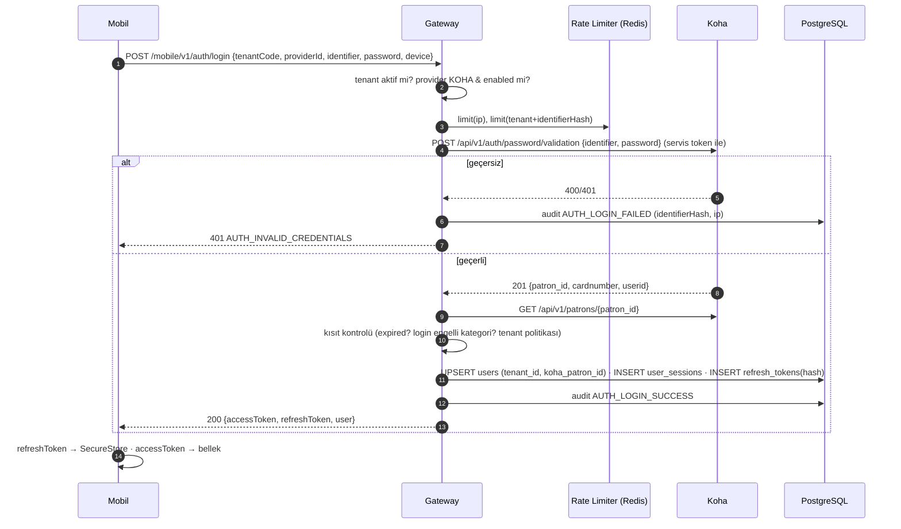
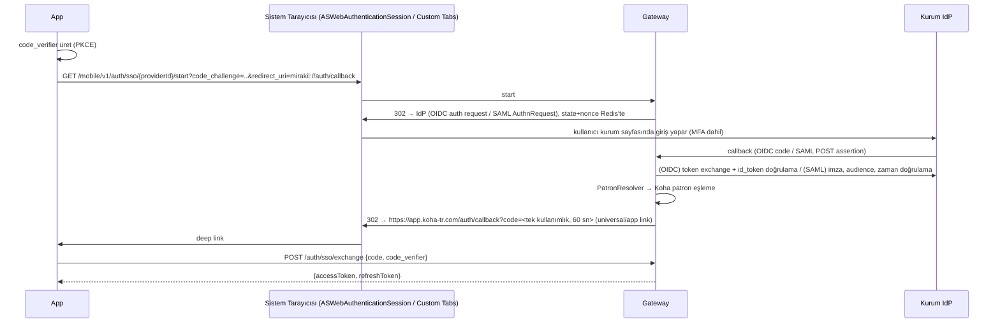

# AUTHENTICATION — Kimlik Doğrulama Mimarisi

> Durum: **Taslak v0.2.** MVP: KOHA (kullanıcı adı / kart numarası + şifre). Mimari LDAP, SAML ve
> OIDC'nin sonradan eklenmesine hazırdır.

## 1. İlkeler

1. **Kimlik kaynağı kurumdur, oturum bizimdir.** Kimlik Koha/LDAP/IdP tarafından doğrulanır; sonrasında
   mobil uygulama yalnızca Gateway'in kısa ömürlü access token'ı ve rotasyonlu refresh token'ını kullanır.
2. **Şifre saklanmaz.** Kullanıcı şifresi yalnızca login isteği süresince bellekte bulunur; DB'ye, Redis'e,
   log'a, Sentry'ye yazılmaz (pino redact + Sentry `beforeSend` scrub). Hash olarak da saklanmaz.
3. **Tenant bağlamı login'de sabitlenir** ve token ömrü boyunca değişmez.
4. **patron_id istemciye hiç verilmez ve istemciden hiç alınmaz.** Token'daki `sub` platform kullanıcı
   UUID'sidir; Koha patron ID'si sunucu tarafında `users` tablosundan çözülür.
5. Kullanıcı varlığı sızdırılmaz: "kullanıcı yok" ve "şifre yanlış" aynı yanıtı döner.

## 2. AuthProvider Soyutlaması

```ts
// packages/types — paylaşılan
export type AuthProviderType = 'KOHA' | 'LDAP' | 'SAML' | 'OIDC';

// apps/api/src/modules/auth/providers/auth-provider.interface.ts
export interface AuthProvider {
  readonly type: AuthProviderType;
  readonly flow: 'CREDENTIALS' | 'REDIRECT';

  /** CREDENTIALS akışı (KOHA, LDAP) */
  authenticate?(tenant: TenantContext, input: { identifier: string; password: string }):
    Promise<ExternalIdentity>;

  /** REDIRECT akışı (SAML, OIDC) */
  buildAuthorizationRequest?(tenant: TenantContext, opts: { state: string; nonce: string;
    codeChallenge: string; redirectUri: string }): Promise<URL>;
  handleCallback?(tenant: TenantContext, payload: unknown): Promise<ExternalIdentity>;
}

export interface ExternalIdentity {
  providerId: string;
  externalSubject: string;          // Koha: patron_id, LDAP: DN/uid, SAML: NameID, OIDC: sub
  matchValue: { attribute: 'userid' | 'cardnumber' | 'email'; value: string } | null;
  kohaPatronId?: string;            // KOHA provider doğrudan döndürür
}
```

`PatronResolver`: `ExternalIdentity` → Koha patron. KOHA provider için doğrudan; LDAP/SAML/OIDC için
`user_identities` tablosunda önceki eşleme, yoksa `matchValue` ile Koha'da patron araması
(`GET /patrons?userid=...`). Tam olarak **bir** eşleşme yoksa giriş reddedilir (`AUTH_PATRON_NOT_FOUND`).

| Provider | Akış | Doğrulama | Patron eşleme | Faz |
|---|---|---|---|---|
| `KOHA` | Credentials | `POST /api/v1/auth/password/validation` | Yanıttaki `patron_id` | **MVP** |
| `LDAP` | Credentials | Gateway → kurum LDAP(S) bind (yalnızca LDAPS/StartTLS) | `uid`/`mail` attribute → Koha `userid`/`email` | Faz 2+ |
| `OIDC` | Redirect (Auth Code + PKCE) | Kurum IdP (Azure AD, Keycloak, Google Workspace) | `sub` + claim (`email`, `preferred_username`) | Faz 3 |
| `SAML` | Redirect (SP-initiated) | Kurum IdP / **EduGAIN–YÖK Kimlik Federasyonu** uyumlu | NameID / `eduPersonPrincipalName` | Faz 3 |

> Not: Koha'nın kendisi LDAP'a bağlıysa (Koha `C4::Auth_with_ldap`), `KOHA` provider
> `/auth/password/validation` üzerinden zaten LDAP ile doğrulamış olur (Koha sürümüne bağlı ≈, test edilecek).
> Bu durumda Gateway'de ayrı LDAP provider'a gerek kalmayabilir.

## 3. KOHA Login Akışı (MVP)



**Kısıt politikası (tenant ayarı):** Üyeliği bitmiş veya kısıtlı (debarred) kullanıcılar giriş
yapabilsin mi? Öneri: **giriş yapabilsin**, yalnızca işlem yetkileri Koha politikalarınca kısıtlansın ve
ana sayfada uyarı gösterilsin (kullanıcı borcunu/iade tarihini görebilmeli). `loginBlockedCategories`
listesi ile belirli kategoriler (ör. personel dışı kurumsal hesaplar) engellenebilir.

**Koha'da özel durumlar:**
- Kart numarası ve kullanıcı adının ikisi de kabul edilir (`identifier`). Eski sürümlerde (`identifier`
  parametresi yoksa) Gateway önce `userid`, başarısızsa `cardnumber` ile dener (tek rate-limit sayacı).
- Koha'nın `FailedLoginAttempts` / hesap kilitleme davranışı korunur; Gateway kendi denemeleriyle hesabı
  gereksiz yere kilitlememek için limiti Koha limitinin altında tutar.

## 4. Token Tasarımı

### 4.1 Access token (JWT)

| Özellik | Değer |
|---|---|
| Algoritma | `EdDSA` (Ed25519) veya `ES256`; imza anahtarı `KeyProvider` ile korunur (dosya / OpenBao), `kid` ile rotasyon; JWKS yalnızca iç kullanım |
| Ömür | **15 dakika** |
| Saklama (mobil) | Yalnızca bellek (Zustand, persist edilmez) |
| Claim'ler | `iss` (kurulum başına farklı — CENTRAL / her ON_PREMISE kurulumu; bir kurulumun token'ı diğerinde geçmez), `aud: "mobile"`, `sub` (user UUID), `tid` (tenant UUID), `sid` (session UUID), `iat`, `exp`, `jti`, `amr` (`["pwd"]`, `["sso"]`) |
| İçermez | patron_id, kart no, e-posta, ad, yetki listesi |

Doğrulama her istekte: imza, `exp`, `aud`, `iss` + Redis'te `sess:{sid}:revoked` kontrolü (anında iptal)
+ tenant aktiflik (cache'li).

### 4.2 Refresh token

| Özellik | Değer |
|---|---|
| Format | Opak, 256-bit rastgele (`rt_` + base64url) |
| DB'de | Yalnızca `SHA-256` hash'i (`refresh_tokens.token_hash`) |
| Ömür | Kayan **30 gün**, mutlak oturum sınırı **180 gün** (tenant ayarlanabilir) |
| Saklama (mobil) | `expo-secure-store` (`keychainAccessible: WHEN_UNLOCKED_THIS_DEVICE_ONLY`) |
| Rotasyon | **Her kullanımda** yeni token; eski `used_at` ile işaretlenir, `replaced_by_id` doldurulur |
| Reuse tespiti | Kullanılmış bir token tekrar gelirse → **tüm oturum ailesi iptal** (`revoke_reason = REUSE_DETECTED`), audit + güvenlik log'u |
| Yarış durumu | Aynı token için 30 sn grace window: aynı cihazdan eşzamanlı iki refresh gelirse ikincisine aynı yeni token çifti döner (Redis kilidi) — yanlış pozitif "reuse" önlenir |
| Cihaz bağlama | Session `installation_id` ile ilişkilidir; farklı `X-Installation-Id` ile gelen refresh reddedilir |

```mermaid
sequenceDiagram
  participant App
  participant GW
  participant DB
  App->>GW: POST /auth/refresh {refreshToken}
  GW->>DB: SELECT ... WHERE token_hash = sha256(rt) FOR UPDATE
  alt bulunamadı / süresi dolmuş / session revoked
    GW-->>App: 401 AUTH_SESSION_REVOKED
  else used_at dolu (reuse)
    GW->>DB: UPDATE user_sessions SET revoked_at=now(), revoke_reason='REUSE_DETECTED'
    GW-->>App: 401 AUTH_SESSION_REVOKED
  else geçerli
    GW->>DB: UPDATE old SET used_at=now(); INSERT new; UPDATE session.last_refreshed_at
    GW-->>App: 200 {accessToken, refreshToken}
  end
```

### 4.3 Oturum iptali tetikleyicileri

- Kullanıcı çıkışı (`/auth/logout`) → session revoke + cihaz push kaydı ayrılır.
- Şifre değişikliği → kullanıcının **diğer** tüm oturumları revoke.
- Tenant pasifleştirme → tenant'ın tüm oturumları revoke (toplu job) + guard seviyesinde anında red.
- Refresh token reuse → aile revoke.
- Admin işlemi (ileride: kullanıcının oturumlarını sonlandır).
- Periyodik doğrulama: Worker, aktif oturumu olan kullanıcıların Koha'da hâlâ var olduğunu periyodik
  kontrol eder (patron silindiyse oturum revoke + `users.disabled_at`).

## 5. Mobil Taraf

```
Uygulama açılışı
  ├─ SecureStore: tenantCode var mı? ──hayır──► Kurum Seçimi
  ├─ tenant config'i getir (cache'li, configVersion kontrolü)
  ├─ SecureStore: refreshToken var mı? ──hayır──► Login
  └─ POST /auth/refresh ──başarılı──► Ana Sayfa
                         └─401──► SecureStore temizle (tenant hariç) ──► Login
```

- `packages/api-client` interceptor'ı: 401 `AUTH_TOKEN_EXPIRED` → tek seferlik (single-flight) refresh
  → isteği tekrar dene. Paralel istekler aynı refresh promise'ini bekler.
- **Kurum Değiştir:** logout çağrısı → SecureStore'daki tenant + token silinir → TanStack Query
  cache'i ve MMKV offline cache'i tamamen temizlenir → push token kaydı silinir → Kurum Seçimi ekranı.
- Opsiyonel: biyometrik kilit (Face ID / parmak izi) ile uygulamayı açma — refresh token'ı biyometri
  korumalı SecureStore anahtarında tutma (Faz 2).
- Jailbreak/root tespiti zorunlu değil; tespit edilirse uyarı (Faz 2).

## 6. SSO (SAML / OIDC) Akışı — Gelecek

Mobil uygulama IdP ile doğrudan konuşmaz; **Gateway bir SP/RP olarak** davranır (IdP konfigürasyonu
kurum başına tek yerde, mobil güncelleme gerekmez).



- Tek kullanımlık kod PKCE ile bağlanır (kodun başka uygulama tarafından yakalanması etkisiz kalır).
- iOS'ta Universal Links / Android'de App Links tercih edilir (custom scheme yerine).
- SAML için `passport-saml`/`@node-saml`, OIDC için `openid-client` kütüphaneleri.

## 7. Admin Kimlik Doğrulama

- E-posta + şifre (argon2id) + **TOTP 2FA zorunlu**; ileride MirAkıl kurumsal OIDC.
- Oturum: httpOnly, `Secure`, `SameSite=Strict` cookie; 8 saat mutlak, 30 dk inaktivite.
- CSRF: double-submit token.
- Roller: `PLATFORM_ADMIN` (tüm tenant'lar, secret yazma), `TENANT_ADMIN` (atandığı tenant'ta duyuru,
  çalışma saatleri, istatistik okuma; secret ve Koha bağlantısı göremez).
- Tüm admin işlemleri audit log'a.

## 8. Rate Limit ve Kötüye Kullanım

| Kapsam | Limit (öneri) |
|---|---|
| `POST /auth/login` / IP | 20 / dk, 200 / saat |
| `POST /auth/login` / tenant + identifierHash | 5 / 15 dk → sonra artan bekleme |
| `POST /auth/refresh` / session | 10 / dk |
| `POST /me/password` / user | 5 / saat |
| Tenant genelinde login | Koha'yı korumak için tenant başına eşzamanlılık limiti |

Başarısız denemeler audit log'a `identifierHash` (HMAC) ile yazılır, düz identifier yazılmaz.

## 9. Güvenlik Kontrol Listesi

- [ ] Şifre hiçbir log/trace/hata raporunda yok (otomatik test: log çıktısında test şifresi aranır)
- [ ] Token'da PII yok
- [ ] Refresh token yalnızca hash olarak DB'de
- [ ] Reuse detection testi
- [ ] Cross-tenant: A tenant token'ı ile B tenant kaynağı → 404
- [ ] IDOR: başka patronun checkoutId'si ile yenileme → 404
- [ ] Tenant pasifleştirince mevcut access token'lar reddediliyor
- [ ] Şifre değişiminde diğer oturumlar düşüyor
- [ ] Kurum Değiştir'de tüm yerel veriler siliniyor
