# DATABASE — Veri Modeli

> Durum: **Taslak v0.1.** PostgreSQL 16+. Tüm zaman alanları `timestamptz` (UTC); gösterimde tenant
> saat dilimi kullanılır. Birincil anahtarlar **UUID v7** (sıralanabilir).

## 1. İlkeler

1. **Koha "source of truth"tır.** Ödünç, rezervasyon, borç, katalog verisi kalıcı saklanmaz.
   PostgreSQL yalnızca platformun kendi verisini tutar.
2. **Veri minimizasyonu (KVKK).** Kullanıcı tablosunda Koha'dan gelen PII'nin yalnızca gerekli
   minimumu (görünen ad, kart no) tutulur; e-posta/telefon gibi alanlar her istekte Koha'dan okunur.
3. **Tenant izolasyonu:** Tenant'a ait her tabloda `tenant_id NOT NULL`, ilgili index'lerin başında
   `tenant_id`, **Row Level Security** açık.
4. **Hiçbir şifre saklanmaz.** Koha kullanıcı şifresi ne düz metin ne hash olarak saklanır; yalnızca
   login anında Koha'ya doğrulama için iletilir.
5. **Secret'lar şifreli:** Koha client secret, LDAP bind şifresi, OIDC client secret vb. envelope
   encryption ile (§5).
6. **Soft delete** yalnızca tenant için (`deactivated_at`); diğer kayıtlar saklama politikasıyla silinir.

## 2. ER Diyagramı

```mermaid
erDiagram
  TENANTS ||--|| TENANT_KOHA_CONNECTIONS : "has"
  TENANTS ||--o{ TENANT_AUTH_PROVIDERS : "configures"
  TENANTS ||--|| TENANT_FEATURES : "has"
  TENANTS ||--o{ TENANT_LIBRARY_HOURS : "defines"
  TENANTS ||--o{ USERS : "owns"
  TENANTS ||--o{ ANNOUNCEMENTS : "publishes"
  TENANTS ||--o{ KOHA_API_ERRORS : "logs"
  TENANTS ||--o{ TENANT_HEALTH_CHECKS : "monitored by"
  TENANTS ||--o{ ADMIN_USER_TENANTS : "managed by"
  ADMIN_USERS ||--o{ ADMIN_USER_TENANTS : "assigned"
  USERS ||--o{ USER_SESSIONS : "has"
  USER_SESSIONS ||--o{ REFRESH_TOKENS : "rotates"
  USERS ||--o{ DEVICES : "registers"
  USERS ||--|| NOTIFICATION_PREFERENCES : "has"
  USERS ||--o{ NOTIFICATIONS : "receives"
  NOTIFICATIONS ||--o{ NOTIFICATION_DELIVERIES : "delivered via"
  DEVICES ||--o{ NOTIFICATION_DELIVERIES : "target"
  USERS ||--o{ USER_IDENTITIES : "linked"
  TENANT_AUTH_PROVIDERS ||--o{ USER_IDENTITIES : "issues"
  ANNOUNCEMENTS ||--o{ ANNOUNCEMENT_READS : "read by"
  USERS ||--o{ ANNOUNCEMENT_READS : "reads"
  TENANTS ||--o{ PAYMENT_TRANSACTIONS : "future"
  USERS ||--o{ PAYMENT_TRANSACTIONS : "future"

  TENANTS {
    uuid id PK
    citext code UK "örn. ankara-uni"
    text name
    text short_name
    text city
    text logo_url
    text logo_dark_url
    text primary_color
    text secondary_color
    text opac_url
    text timezone "Europe/Istanbul"
    char currency "TRY"
    text default_locale "tr"
    text marc_flavour "MARC21 | UNIMARC"
    boolean active
    text min_app_version
    jsonb contact "e-posta, web"
    timestamptz created_at
    timestamptz updated_at
    timestamptz deactivated_at
  }

  TENANT_KOHA_CONNECTIONS {
    uuid tenant_id PK,FK
    text base_url "https://koha.example.edu.tr"
    text api_base_url "https://.../api/v1"
    text auth_mode "OAUTH2_CLIENT_CREDENTIALS | BASIC"
    text client_id
    bytea client_secret_enc
    text secret_key_version
    text adapter_key "koha2511 | koha2405 | legacy | auto"
    text detected_version
    jsonb capabilities
    boolean plugin_installed
    text plugin_version
    int timeout_ms
    int max_concurrency
    timestamptz capabilities_checked_at
    timestamptz updated_at
  }

  TENANT_AUTH_PROVIDERS {
    uuid id PK
    uuid tenant_id FK
    text type "KOHA | LDAP | SAML | OIDC"
    text display_name
    boolean enabled
    boolean is_default
    int sort_order
    jsonb config "hassas olmayan ayarlar"
    bytea secrets_enc "hassas ayarlar"
    text secret_key_version
    text patron_match_attribute "userid | cardnumber | email"
  }

  TENANT_FEATURES {
    uuid tenant_id PK,FK
    boolean catalog_search
    boolean holds
    boolean hold_cancel
    boolean renewals
    boolean fines
    boolean history
    boolean notifications
    boolean announcements
    boolean password_change
    boolean digital_card
    boolean payments
    jsonb extra "yeni flag'ler için"
    timestamptz updated_at
  }

  TENANT_LIBRARY_HOURS {
    uuid id PK
    uuid tenant_id FK
    text koha_library_id
    smallint weekday "0-6, null=özel gün"
    date special_date
    time opens_at
    time closes_at
    boolean closed
    text note
  }

  USERS {
    uuid id PK
    uuid tenant_id FK
    text koha_patron_id "Koha borrowernumber"
    text cardnumber_hash "HMAC, arama için"
    text display_name
    text locale
    timestamptz membership_expires_at "bildirim için cache"
    timestamptz first_login_at
    timestamptz last_login_at
    timestamptz last_seen_at
    timestamptz disabled_at
  }

  USER_IDENTITIES {
    uuid id PK
    uuid tenant_id FK
    uuid user_id FK
    uuid provider_id FK
    text external_subject "LDAP DN, SAML NameID, OIDC sub"
    timestamptz last_used_at
  }

  USER_SESSIONS {
    uuid id PK
    uuid tenant_id FK
    uuid user_id FK
    uuid device_id FK "nullable"
    text auth_provider_type
    inet created_ip
    text user_agent
    timestamptz created_at
    timestamptz last_refreshed_at
    timestamptz expires_at "mutlak oturum sınırı"
    timestamptz revoked_at
    text revoke_reason
  }

  REFRESH_TOKENS {
    uuid id PK
    uuid tenant_id FK
    uuid session_id FK
    bytea token_hash "SHA-256"
    uuid replaced_by_id
    timestamptz issued_at
    timestamptz expires_at
    timestamptz used_at
    timestamptz revoked_at
  }

  DEVICES {
    uuid id PK
    uuid tenant_id FK
    uuid user_id FK
    text installation_id "uygulama kurulum UUID"
    text platform "ios | android"
    text push_provider "expo | fcm | apns"
    text push_token
    text app_version
    text os_version
    text locale
    boolean push_enabled
    timestamptz last_seen_at
    timestamptz invalidated_at
  }

  NOTIFICATION_PREFERENCES {
    uuid user_id PK,FK
    uuid tenant_id FK
    boolean due_reminders
    smallint_array due_reminder_days "örn. {3,1,0}"
    boolean overdue
    boolean holds
    boolean announcements
    boolean membership
    time quiet_hours_start
    time quiet_hours_end
    timestamptz updated_at
  }

  NOTIFICATIONS {
    uuid id PK
    uuid tenant_id FK
    uuid user_id FK
    text type "DUE_SOON | DUE_TODAY | OVERDUE | HOLD_READY | ..."
    text dedupe_key UK "tenant+user kapsamında benzersiz"
    text title
    text body
    jsonb data "deep link, checkoutId vb."
    timestamptz scheduled_for
    timestamptz read_at
    timestamptz created_at
  }

  NOTIFICATION_DELIVERIES {
    uuid id PK
    uuid tenant_id FK
    uuid notification_id FK
    uuid device_id FK
    text status "QUEUED | SENT | DELIVERED | FAILED | INVALID_TOKEN"
    text provider_message_id "Expo ticket id"
    text error_code
    int attempts
    timestamptz sent_at
    timestamptz updated_at
  }

  ANNOUNCEMENTS {
    uuid id PK
    uuid tenant_id FK "NULL = tüm kurumlar (global)"
    text title
    text body_markdown
    text locale
    text image_url
    boolean push
    text status "DRAFT | PUBLISHED | ARCHIVED"
    timestamptz publish_at
    timestamptz expires_at
    uuid created_by FK
    timestamptz created_at
  }

  ANNOUNCEMENT_READS {
    uuid announcement_id PK,FK
    uuid user_id PK,FK
    uuid tenant_id FK
    timestamptz read_at
  }

  ADMIN_USERS {
    uuid id PK
    citext email UK
    text password_hash "argon2id"
    bytea totp_secret_enc
    text role "PLATFORM_ADMIN | TENANT_ADMIN"
    timestamptz last_login_at
    timestamptz disabled_at
  }

  ADMIN_USER_TENANTS {
    uuid admin_user_id PK,FK
    uuid tenant_id PK,FK
  }

  AUDIT_LOGS {
    uuid id PK
    uuid tenant_id "nullable (platform işlemleri)"
    text actor_type "USER | ADMIN | SYSTEM"
    uuid actor_id
    text action "AUTH_LOGIN_SUCCESS, HOLD_CREATE, TENANT_UPDATE..."
    text target_type
    text target_id
    jsonb metadata "secret/PII içermez"
    inet ip
    text correlation_id
    timestamptz created_at
  }

  KOHA_API_ERRORS {
    uuid id PK
    uuid tenant_id FK
    text correlation_id
    text operation "loans.renew"
    text method
    text path "query string maskelenmiş"
    int http_status
    text koha_error_code
    jsonb response_body "maskelenmiş, kısaltılmış"
    int duration_ms
    timestamptz created_at
  }

  TENANT_HEALTH_CHECKS {
    uuid id PK
    uuid tenant_id FK
    text status "OK | DEGRADED | DOWN"
    int latency_ms
    text detected_version
    jsonb details
    timestamptz checked_at
  }

  PAYMENT_TRANSACTIONS {
    uuid id PK
    uuid tenant_id FK
    uuid user_id FK
    text provider
    text provider_ref
    numeric amount
    char currency
    text status
    jsonb koha_account_lines
    timestamptz created_at
  }
```



> `PAYMENT_TRANSACTIONS` yalnızca ileride ödeme eklendiğinde oluşturulacak; şema yer tutucudur.

## 3. Önemli Kısıtlar ve Index'ler

| Tablo | Kısıt / Index | Amaç |
|---|---|---|
| `tenants` | `UNIQUE (code)`; `code ~ '^[a-z0-9-]{2,40}$'` | Kurum kodu URL/deep link güvenli |
| `users` | `UNIQUE (tenant_id, koha_patron_id)` | Aynı patron için tek platform kullanıcısı |
| `users` | `INDEX (tenant_id, membership_expires_at)` | Üyelik bitişi taraması |
| `user_identities` | `UNIQUE (provider_id, external_subject)` | SSO eşleme |
| `refresh_tokens` | `UNIQUE (token_hash)`; `INDEX (session_id)` | Refresh doğrulama, aile iptali |
| `devices` | `UNIQUE (installation_id)`; `INDEX (tenant_id, user_id) WHERE invalidated_at IS NULL` | Aynı kurulumda kullanıcı/kurum değişince kayıt güncellenir |
| `devices` | `UNIQUE (push_token) WHERE invalidated_at IS NULL` | Token tek aktif kullanıcıya bağlı (kurum değişiminde başka kişiye bildirim gitmez) |
| `notifications` | `UNIQUE (tenant_id, user_id, dedupe_key)` | **Bildirim tekrarını engelleyen ana kısıt** |
| `notifications` | `INDEX (tenant_id, user_id, created_at DESC)`; partial `WHERE read_at IS NULL` | Liste ve okunmamış sayısı |
| `notification_deliveries` | `UNIQUE (notification_id, device_id)` | Aynı cihaza tekrar gönderim yok |
| `audit_logs` | Aylık partition (`created_at`) | Hacim yönetimi |
| `koha_api_errors` | Aylık partition, 90 gün saklama | Panelde "son hatalar" |

**Kompozit tenant FK:** Çapraz-tenant referansı veritabanı seviyesinde imkânsız kılmak için alt
tablolar `(tenant_id, user_id)` → `users(tenant_id, id)` şeklinde kompozit FK kullanır
(`users` üzerinde `UNIQUE (tenant_id, id)`).

## 4. Row Level Security

```sql
-- Örnek: tenant'a ait her tablo için
ALTER TABLE notifications ENABLE ROW LEVEL SECURITY;
ALTER TABLE notifications FORCE ROW LEVEL SECURITY;

CREATE POLICY tenant_isolation ON notifications
  USING (tenant_id = current_setting('app.tenant_id', true)::uuid)
  WITH CHECK (tenant_id = current_setting('app.tenant_id', true)::uuid);
```

- Uygulama rolü `app_rw`: `NOBYPASSRLS`. Her istek/job, Prisma interaktif transaction içinde
  `SELECT set_config('app.tenant_id', $1, true)` çalıştırır (transaction-local).
- `app.tenant_id` set edilmemişse `current_setting(..., true)` NULL döner → **hiç satır görünmez**
  (fail-closed).
- Platform genelinde çalışan işlemler (admin listeleri, worker'ın tenant listesi) ayrı rol
  `app_platform` ile ve yalnızca belirli tablolar için (`tenants`, `tenant_*`, `admin_*`, istatistik
  view'ları).
- RLS, uygulama katmanındaki zorunlu `tenantId` filtrelerinin **yerine değil, yanına** eklenen
  ikinci savunma hattıdır.

## 5. Şifreleme

**Envelope encryption:**

```
KMS/Vault master key (KEK, sistem dışı)
   └─► tenant başına DEK (data encryption key), KEK ile şifreli olarak tenant_keys tablosunda
          └─► AES-256-GCM ile secret alanları: client_secret_enc, secrets_enc, totp_secret_enc
              format: version(1B) | key_version | iv(12B) | ciphertext | authTag(16B)
              AAD = tenant_id || tablo || kolon   (şifreli değerin başka satıra kopyalanmasını engeller)
```

- Çözülmüş secret yalnızca bellekte, kısa süreli (ör. 5 dk) process içi cache'te tutulur; Redis'e yazılmaz.
- Anahtar rotasyonu: `secret_key_version` ile kademeli yeniden şifreleme job'ı.
- Admin API secret'ları **write-only** kabul eder; okuma yanıtında yalnızca `"configured": true`
  ve son güncelleme tarihi döner.
- `cardnumber_hash`: `HMAC-SHA256(pepper, tenant_id || cardnumber)` — kart no ile kullanıcı bulma
  gerekirse; düz kart no gerekirse (dijital kart) her seferinde Koha'dan okunur ve mobilde secure
  store'da tutulur.
- Disk seviyesinde şifreleme ve TLS'li DB bağlantısı (prod) zorunlu.

## 6. Redis Anahtar Şeması

| Anahtar | TTL | İçerik |
|---|---|---|
| `t:{tid}:config` | 5 dk | Tenant public config + features |
| `t:{tid}:koha:token` | Koha token süresi − 60 sn | Koha OAuth2 access token (şifreli) |
| `t:{tid}:u:{uid}:loans` | 60 sn | Normalize ödünç listesi |
| `t:{tid}:u:{uid}:holds` | 60 sn | |
| `t:{tid}:u:{uid}:account` | 120 sn | Borç özeti |
| `t:{tid}:u:{uid}:summary` | 60 sn | Ana sayfa özet |
| `t:{tid}:bib:{biblioId}` | 1 saat | Normalize bibliyografik kayıt (kullanıcıdan bağımsız) |
| `t:{tid}:search:{hash}` | 5 dk | Arama sonucu sayfası |
| `t:{tid}:libraries` | 1 saat | Şubeler |
| `sess:{sid}:revoked` | access token TTL | Anında oturum iptali |
| `rl:*` | pencere süresi | Rate limit sayaçları |
| `bull:*` | — | BullMQ |

Yazma işlemi (yenileme, rezervasyon, iptal) sonrası ilgili kullanıcı cache'leri invalidate edilir.

## 7. Saklama Politikası (öneri)

| Veri | Süre |
|---|---|
| Bildirimler | 180 gün |
| Notification deliveries | 30 gün |
| Revoke/expire olmuş refresh token'lar | 30 gün |
| Audit log | 2 yıl (KVKK ve kurum politikasına göre ayarlanabilir) |
| Koha API hataları | 90 gün |
| Health check | 30 gün (saatlik özet 1 yıl) |
| Pasif (90 gün giriş yapmamış) cihaz | push token invalidate |
| Kullanıcı (kurum tarafından silinen / 2 yıl inaktif) | anonimleştirme |

## 8. Migration ve Ortamlar

- Prisma migrate; RLS policy'leri ve partition'lar SQL migration olarak (`prisma/migrations/*/migration.sql`).
- CI'da `prisma migrate diff` ile drift kontrolü.
- Seed: geliştirme için 2 tenant (KTD 24.05 ve KTD 25.11'e bağlı), örnek admin, örnek duyurular.
