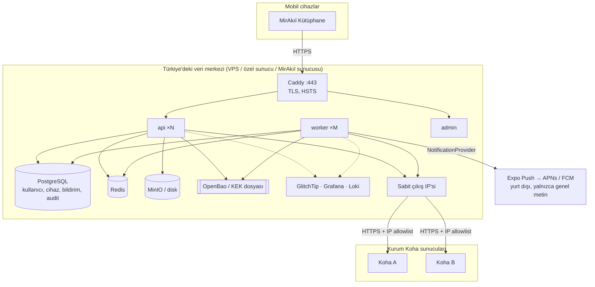
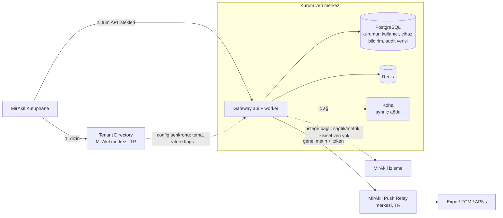

# DEPLOYMENT — Barındırma ve Dağıtım Mimarisi

> Durum: **Taslak v0.2.**
>
> **Onaylanan ilkeler** ([DECISIONS.md](./DECISIONS.md)):
> - Kullanıcı, kurum, cihaz, bildirim ve audit verilerinin bulunduğu merkezi backend'in **Türkiye'de
>   barındırılması tercih edilir**. Mutlak bir teknik "yurt içi zorunluluğu" konmaz.
> - Sistem **Docker tabanlı ve sağlayıcıdan bağımsızdır**. AWS, Azure, Hetzner veya başka bir sağlayıcıya
>   mimari düzeyde bağımlılık yoktur.
> - Kurulum yerleri: Türkiye lokasyonlu VPS / özel sunucu · kurumun kendi veri merkezi · MirAkıl'ın
>   yönettiği merkezi sunucu.
> - Tenant bazında dağıtım modeli: `CENTRAL` (MirAkıl merkezi altyapısı) ve `ON_PREMISE` (kurumun kendi
>   sunucusu). **MVP `CENTRAL` modeliyle geliştirilir**; `ON_PREMISE` için mimari baştan hazır tutulur.

## 1. Sağlayıcıdan Bağımsızlık İlkeleri

1. **Yalnızca standart arayüzler:** Docker image'ları, PostgreSQL protokolü, Redis protokolü,
   S3 uyumlu nesne depolama API'si, SMTP, OpenTelemetry. Yönetilen bulut servisine özgü SDK kullanılmaz.
2. **Her dış bağımlılık için arayüz + varsayılan açık kaynak implementasyon:**

| İhtiyaç | Arayüz (kodda) | Varsayılan (self-hosted) | İsteğe bağlı alternatif |
|---|---|---|---|
| Uygulama çalıştırma | Docker image | Docker Compose | Docker Swarm, Kubernetes (Helm) |
| Veritabanı | PostgreSQL 16 | PostgreSQL container / ayrı sunucu | Herhangi bir yönetilen PostgreSQL |
| Cache / kuyruk | Redis 7 | Redis container (AOF açık) | Valkey, yönetilen Redis |
| Dosya depolama (logo, kapak cache) | `StorageProvider` | **Yerel disk (volume)** veya **MinIO** (S3 uyumlu) | Herhangi bir S3 uyumlu servis |
| Anahtar yönetimi (KEK) | `KeyProvider` | **Dosya / Docker secret** (MVP) → **OpenBao/Vault Transit** | PKCS#11 HSM, bulut KMS adaptörü (opsiyonel eklenti) |
| Reverse proxy / TLS | — | **Caddy** (otomatik Let's Encrypt) veya Nginx/Traefik | Kurumun mevcut yük dengeleyicisi |
| Hata takibi | Sentry SDK (protokol) | **GlitchTip** (Sentry uyumlu, self-hosted) veya self-hosted Sentry | — |
| Log / metrik / trace | OpenTelemetry, pino JSON | Grafana + Loki + Prometheus + Tempo | Kurumun mevcut ELK/izleme altyapısı |
| E-posta (admin bildirimleri) | `MailProvider` | SMTP | — |
| Push bildirim | `NotificationProvider` | Expo (MVP) | FCM/APNs doğrudan, Push Relay ([NOTIFICATIONS.md](./NOTIFICATIONS.md)) |
| Image registry | OCI | MirAkıl özel registry (Harbor) | GHCR, Docker Hub (private) |

3. **Konfigürasyon yalnızca ortam değişkenleri ve secret dosyaları ile** (12-factor). Sağlayıcıya özgü
   metadata servisi kullanılmaz.
4. **Mobil crash/hata raporları da Türkiye'deki backend'e gider:** Mobil Sentry SDK'sı self-hosted
   GlitchTip/Sentry'ye yönlendirilir (Sentry SaaS kullanılmaz).
5. **Yurt dışına zorunlu çıkan veriler** belgelenir ve minimize edilir (§6).

## 2. Docker Bileşenleri

| Servis (image) | Görev | Ölçek |
|---|---|---|
| `mirakil/kutuphane-api` | Gateway API (`node dist/main.js`) | Yatay (stateless) |
| `mirakil/kutuphane-api` (worker komutu) | BullMQ worker (`node dist/worker.js`) | Yatay (kuyruk derinliğine göre) |
| `mirakil/kutuphane-api` (migrate komutu) | Tek seferlik Prisma migration + RLS policy | Her sürümde bir kez |
| `mirakil/kutuphane-admin` | Admin paneli statik dosyaları (Nginx) | 1+ |
| `postgres:16` | Veritabanı | Tek birincil (+ isteğe bağlı replika) |
| `redis:7` | Cache, kuyruk, rate limit | Tek (+ isteğe bağlı Sentinel) |
| `caddy` | TLS sonlandırma, reverse proxy, güvenlik başlıkları | 1+ |
| `minio` (opsiyonel) | Nesne depolama | 1 |
| `openbao` (opsiyonel, önerilen prod) | KEK / transit encryption | 1 (HA opsiyonel) |
| `glitchtip`, `grafana`, `loki`, `prometheus`, `otel-collector` (opsiyonel) | Gözlemlenebilirlik | Ayrı "ops" compose dosyası |

Compose dosyaları:

```
infra/docker/
  compose.base.yml          api, worker, admin, postgres, redis, caddy
  compose.storage.yml       minio
  compose.secrets.yml       openbao
  compose.observability.yml glitchtip, grafana, loki, prometheus, tempo, otel-collector
  compose.dev.yml           geliştirme (hot reload, KTD Koha bağlantısı, mailpit)
  env/
    central.env.example
    on-premise.env.example
  caddy/Caddyfile
```

Kurulum örneği (merkezi tek sunucu):

```bash
docker compose -f compose.base.yml -f compose.storage.yml -f compose.observability.yml \
  --env-file env/central.env up -d
docker compose run --rm api migrate
```

### 2.1 Alan adları

| Alan adı | Servis | Not |
|---|---|---|
| `api.koha-tr.com` | Gateway API (`/mobile/v1`, `/admin/v1`) | CENTRAL tenant'ların `apiBaseUrl` değeri |
| `directory.koha-tr.com` | Tenant Directory | Mobilde sabit kodlanan **tek** adres; MVP'de Gateway ile aynı uygulama, ayrı host adı |
| `admin.koha-tr.com` | Yönetim paneli | İsteğe bağlı IP kısıtı; `/admin/v1` çağrıları `api.koha-tr.com`'a (CORS yalnızca bu origin) |
| `app.koha-tr.com` | Universal Links / App Links, SSO geri dönüşü, gizlilik politikası ve destek sayfaları | `/.well-known/apple-app-site-association`, `/.well-known/assetlinks.json` |
| `relay.koha-tr.com` | MirAkıl Push Relay (ON_PREMISE fazında) | mTLS ile yalnızca kayıtlı kurulumlar |
| `status.koha-tr.com` (öneri) | Durum sayfası | İsteğe bağlı |
| `errors.koha-tr.com` / `ops.koha-tr.com` (öneri) | GlitchTip, Grafana | Yalnızca VPN/IP kısıtlı; mobil SDK'nın hata gönderdiği uç herkese açık olmalıdır |

- Tüm host adları Caddy üzerinden TLS (Let's Encrypt, otomatik yenileme), HSTS (`includeSubDomains`) ile sunulur.
- Alan adları marka değildir: mağaza adı ve uygulama içi marka **MirAkıl Kütüphane** olarak kalır.
- Host adları kodda sabit değildir; ortam değişkenleriyle verilir (`PUBLIC_API_URL`, `DIRECTORY_URL`, ...).
  Mobilde yalnızca derleme zamanı `EXPO_PUBLIC_DIRECTORY_URL` bulunur (gizli bilgi değildir).

## 3. CENTRAL Modeli (MVP)



### 3.1 Önerilen boyutlandırma

| Aşama | Topoloji | Kaynak (yaklaşık) |
|---|---|---|
| **Pilot (onaylandı)** — 1–3 kurum, < 20 bin kullanıcı | Türkiye lokasyonlu, **Koha üretim sunucusundan bağımsız** tek sunucu, tüm servisler Compose ile | **4 vCPU, 8 GB RAM, 80–160 GB NVMe** + sunucu dışında yedek alanı |
| Büyüme (≤ 50 kurum) | 2 uygulama sunucusu (api+worker) + 1 DB sunucusu + 1 ops sunucusu | Uygulama: 4 vCPU/8 GB ×2 · DB: 8 vCPU/32 GB NVMe |
| Ölçek (100+ kurum) | Swarm/Kubernetes, PostgreSQL birincil + replika (Patroni), Redis Sentinel | Yük testine göre (Faz 6) |

**Pilot sunucu bellek bütçesi (8 GB):**

| Servis | Bellek sınırı (Compose `mem_limit`) |
|---|---|
| PostgreSQL (`shared_buffers=1GB`) | 2 GB |
| Redis (`maxmemory 384mb`, AOF) | 512 MB |
| api ×2 | 2 × 512 MB |
| worker ×1 | 512 MB |
| Caddy + admin (Nginx) | 256 MB |
| GlitchTip (web + worker; kendi PostgreSQL DB'si ortak sunucuda ayrı veritabanı olarak) | 1 GB |
| Prometheus + Grafana + Loki (kısa saklama: 7 gün) | 1.5 GB |
| İşletim sistemi + tampon | ~1 GB |

- Pilotta Tempo (trace), MinIO ve OpenBao **kurulmaz**: logolar yerel volume'da, KEK Docker secret
  dosyasında (bkz. §8). Kaynak yetmezse ilk olarak gözlemlenebilirlik yığını ayrı küçük bir sunucuya taşınır.
- Disk: 80 GB yeterlidir (DB < 5 GB, loglar 7 gün); **160 GB önerilir** (yerel yedek kopyası + log payı).
  Asıl yedek mutlaka **sunucu dışında** (Türkiye'de ikinci lokasyon) tutulur.
- Bu sunucunun sabit çıkış IP'si, pilot kurumların Koha test ortamında allowlist'e eklenir.

### 3.2 Ağ ve güvenlik

- Dışarıya yalnızca **443** açık (Caddy). SSH yalnızca VPN/bastion üzerinden. PostgreSQL ve Redis yalnızca
  iç Docker ağında.
- **Sabit çıkış IP'si:** Kurumlar Koha sunucularında yalnızca bu IP'ye izin verir.
- Admin paneli ayrı alt alan adında ve isteğe bağlı olarak IP kısıtlı (`admin.…`).
- Konteynerler root olmayan kullanıcıyla, salt okunur dosya sistemiyle (`read_only: true`) çalışır.
- Image'lar imzalı (cosign) ve zafiyet taramalı (Trivy) olarak yayınlanır.

### 3.3 Yedekleme ve felaket kurtarma

| Bileşen | Yöntem | Sıklık / saklama |
|---|---|---|
| PostgreSQL | `pgBackRest` veya `wal-g` → S3 uyumlu hedef / ayrı disk (şifreli) | Günlük tam + sürekli WAL, 30 gün; PITR |
| Yedek kopyası | **Türkiye'deki ikinci lokasyon** (farklı veri merkezi / sağlayıcı) | Günlük |
| Redis | AOF + günlük RDB (kuyruk kaybı tolere edilebilir; bildirimler DB'den yeniden üretilebilir) | 7 gün |
| Nesne depolama | `mc mirror` | Günlük |
| KEK | Çevrim dışı, şifreli, iki kişilik erişim (MirAkıl yetkilileri) | Her rotasyonda |
| Geri dönüş testi | Staging'e yedekten kurulum | Aylık |

Hedefler (pilot): RPO ≤ 15 dk, RTO ≤ 4 saat.

### 3.4 Güncelleme

- Semver image etiketleri (`1.4.2`); `latest` kullanılmaz.
- Sıra: `migrate` → `api` (rolling) → `worker`. Migration'lar geriye uyumlu yazılır (expand/contract).
- Mobil uyumluluk: Gateway `/mobile/v1` sözleşmesini korur; kırıcı değişiklik yalnızca `/mobile/v2` ile.

## 4. Tenant Dizini (Tenant Directory)

`ON_PREMISE` desteğinin anahtarı: **Mobil uygulama Gateway adresini sabit kodlamaz.** Uygulamada yalnızca
merkezi **Tenant Directory** adresi bulunur; her tenant'ın Gateway adresi dizinden öğrenilir.

```
Mobil ──(1) GET https://directory.koha-tr.com/mobile/v1/tenants──► Tenant Directory (merkezi, TR)
       ◄── [{ code, name, logoUrl, city, deploymentMode, apiBaseUrl }]
Mobil ──(2) GET {apiBaseUrl}/mobile/v1/tenants/{code}/config ──► İlgili Gateway
Mobil ──(3) tüm diğer istekler {apiBaseUrl} ──► İlgili Gateway
```

- `CENTRAL` tenant'larda `apiBaseUrl` = merkezi Gateway (MVP'de dizin ve Gateway aynı uygulamadır;
  `tenants` modülü dizin uçlarını da sunar).
- `ON_PREMISE` tenant'larda `apiBaseUrl` = kurumun kendi Gateway'i (ör. `https://kutuphane-api.ornek.edu.tr`).
- Dizin **yalnızca herkese açık kurum bilgisi** içerir (ad, logo, şehir, adres); kişisel veri içermez.
- Mobil, seçilen tenant'ın `apiBaseUrl` değerini SecureStore'da saklar; dizin yanıtı imzalıdır
  (Ed25519, uygulamaya gömülü açık anahtarla doğrulanır) — sahte bir Gateway adresinin enjekte
  edilmesi engellenir.
- Gateway adresi değişirse (kurum CENTRAL → ON_PREMISE taşınırsa) mobil, açılışta dizinden güncel adresi
  alır; eski adresteki oturum geçersiz olduğu için kullanıcı bir kez yeniden giriş yapar.

## 5. ON_PREMISE Modeli (sonraki faz, mimari hazır)

### 5.1 Ne kurulur?

Kurumun veri merkezine **aynı Docker image'ları** kurulur (`compose.base.yml` + `on-premise.env`):
api, worker, PostgreSQL, Redis, Caddy. Bu kurulum **tek tenant'lı** çalışır
(`DEPLOYMENT_MODE=ON_PREMISE`, `SINGLE_TENANT_CODE=ornek-uni`).



### 5.2 Kod tabanı gereksinimleri (MVP'den itibaren uyulacak)

| Gereksinim | Neden |
|---|---|
| Tek kod tabanı, `DEPLOYMENT_MODE` ile davranış | Ayrı "on-prem sürümü" bakımı olmasın |
| Tenant izolasyonu tek tenant'lı kurulumda da açık | Aynı güvenlik garantileri |
| Merkeze zorunlu bağımlılık yok (dizin hariç) | Kurum ağı merkeze erişemese de mobil API çalışsın |
| Push gönderimi `NotificationProvider` üzerinden | ON_PREMISE'te `RelayNotificationProvider` seçilir |
| Admin işlevleri: yerel admin + merkezden config senkronu | Tema/feature flag merkezi yönetilebilsin |
| `iss` (token yayıncısı) kurulum başına farklı | Bir kurulumun token'ı diğerinde geçmez |
| Lisans/sürüm bilgisi Gateway `GET /mobile/v1/app/config` içinde | Mobil uyumluluk kontrolü |

### 5.3 ON_PREMISE için bildirimler

Mağazadaki uygulama tektir; APNs anahtarı ve FCM projesi MirAkıl'a aittir. Bu kimlik bilgilerini
kurumlara dağıtmak güvenli değildir. Öneri: **MirAkıl Push Relay** (merkezi, Türkiye'de):

- Kurum Gateway'i `RelayNotificationProvider` ile relay'e yalnızca `OutboundPush` gönderir:
  cihaz token'ı + **genel şablon metni** + opak `MirakilPushDataV1`. Kişisel veri relay'e ulaşmaz.
- Kimlik doğrulama: kurulum başına mTLS sertifikası veya imzalı istek (HMAC/Ed25519), relay'de
  kurulum başına hız sınırı.
- Relay, arka planda merkezdeki ile aynı `NotificationProvider`'ları (Expo → FCM/APNs) kullanır.
- Ayrıntılı bildirim içeriği kurumun kendi DB'sinde kalır; mobil uygulama ayrıntıyı kurum Gateway'inden çeker.

### 5.4 Operasyon

- Kurulum paketi: compose dosyaları, `on-premise.env.example`, kurulum ve güncelleme rehberi, sağlık
  kontrol betiği.
- Güncellemeler: MirAkıl registry'sinden imzalı image; kurum IT'si veya MirAkıl (uzaktan erişim
  sözleşmesiyle) uygular. Desteklenen sürüm penceresi: son 2 minor.
- Gözlemlenebilirlik: yerel; isteğe bağlı olarak **kişisel veri içermeyen** sağlık/metrik özetleri merkeze.

## 6. Veri Konumu Özeti

| Veri | CENTRAL | ON_PREMISE | Yurt dışına çıkar mı? |
|---|---|---|---|
| Kurum tanımları, tema, feature flags | Merkezi DB (TR) | Dizin (TR) + kurum DB | Hayır |
| Koha bağlantı secret'ları | Merkezi DB, şifreli (TR) | Kurum DB, şifreli | Hayır |
| Kullanıcı eşlemesi, oturumlar, refresh token hash'leri | Merkezi DB (TR) | Kurum DB | Hayır |
| Cihazlar ve push token'ları | Merkezi DB (TR) | Kurum DB | Token'lar Expo/Apple/Google'a iletilir |
| Bildirimler (ayrıntılı içerik), tercihler | Merkezi DB (TR) | Kurum DB | Hayır |
| Push metni ve payload | — | — | **Evet** (Expo, APNs, FCM) — yalnızca genel metin + opak ID |
| Audit log, Koha API hata kayıtları | Merkezi DB (TR) | Kurum DB | Hayır |
| Ödünç / rezervasyon / borç / katalog | Kalıcı saklanmaz; Redis'te kısa süreli cache (TR) | Kurum Redis | Hayır |
| Uygulama hata raporları (mobil + backend) | Self-hosted GlitchTip (TR) | Kurum veya merkez (kararlaştırılacak) | Hayır |
| Uygulama binary'si (EAS Build), OTA güncellemeleri (EAS Update) | Expo altyapısı | — | Evet, ancak kişisel veri içermez |

> EAS Update (OTA) kullanılırsa uygulama açılışında Expo sunucularına sürüm kontrolü isteği gider (IP adresi
> görülebilir). KVKK değerlendirmesinde ele alınmalı; gerekirse OTA kapatılır veya self-hosted bir
> güncelleme sunucusu (Expo Updates protokolü) kullanılır.

## 7. Ortamlar

| Ortam | Yer | Not |
|---|---|---|
| `local` | Geliştirici makinesi, `compose.dev.yml` | KTD ile Koha 24.05 / 25.11 |
| `staging` | Türkiye'de ayrı sunucu | Test Koha'ları + pilot kurumların test Koha'ları |
| `production` | Türkiye'de CENTRAL kurulum | Pilot kurumlar |

## 8. Secret Yönetimi

**Kural: Hiçbir anahtar, şifre, token veya sertifika özel anahtarı repoda tutulmaz** (D17). Secret'lar
yalnızca ortam/secret yönetimi üzerinden verilir.

### 8.1 Secret türleri ve yerleri

| Secret | Nerede tutulur | Uygulamaya nasıl ulaşır |
|---|---|---|
| PostgreSQL / Redis şifreleri | Sunucuda secret dosyası (`/etc/mirakil/secrets/`, `chmod 600`, root) | Docker secrets → `/run/secrets/*`, uygulama `*_FILE` değişkeninden okur |
| KEK (envelope encryption ana anahtarı) | Pilot: Docker secret dosyası · Prod: OpenBao/Vault Transit (anahtar sunucudan çıkmaz) | `KeyProvider` |
| JWT imza anahtarları | Docker secret (pilot) / OpenBao (prod) | `KeyProvider`, `kid` ile rotasyon |
| Tenant Directory imza anahtarı | Docker secret / OpenBao | Yalnızca dizin servisi |
| Koha client secret'ları, LDAP/OIDC secret'ları | **Veritabanında, KEK ile şifreli**; admin panelinden write-only girilir | Çalışma anında çözülür, Redis'e yazılmaz |
| Expo access token, FCM servis hesabı, APNs `.p8` anahtarı | Push: sunucuda Docker secret · Build: **EAS Secrets / EAS credentials** | `NotificationProvider` |
| `google-services.json`, `GoogleService-Info.plist` | EAS file secret (repoda değil) | EAS Build sırasında |
| Mağaza imza anahtarları (keystore, sertifikalar) | EAS credentials (yedeği MirAkıl'ın şifreli kasasında) | EAS Build |
| CI secret'ları (registry, deploy SSH anahtarı) | GitHub Actions Secrets / Environments (onaylı ortam) | CI |
| Admin TOTP secret'ları | Veritabanında, KEK ile şifreli | — |

### 8.2 Repoda bulunanlar

- Yalnızca örnek dosyalar: `infra/docker/env/*.env.example` (değerler `CHANGE_ME` / boş), secret dosya
  **adlarının** listesi, kurulum betiği (`scripts/generate-secrets.sh` — sunucuda rastgele değer üretir).
- `.gitignore`: `.env`, `.env.*` (`.env.example` hariç), `secrets/`, `*.pem`, `*.p8`, `*.p12`, `*.jks`,
  `*.keystore`, `google-services.json`, `GoogleService-Info.plist`.
- Mobilde yalnızca `EXPO_PUBLIC_*` değişkenleri bulunur ve bunlar **gizli kabul edilmez** (uygulama
  paketinden okunabilir); bu nedenle yalnızca herkese açık değerler (ör. dizin adresi) içerir.

### 8.3 Koruma önlemleri

- **gitleaks**: pre-commit hook + CI'da her push/PR'da tarama; bulgu varsa CI kırmızı.
- GitHub secret scanning ve push protection açık.
- Uygulama açılışında secret'lar doğrulanır; eksik/örnek değer (`CHANGE_ME`) ile **başlamaz** (fail-fast).
- Log redact listesi: `password`, `secret`, `token`, `authorization`, `cookie`, `client_secret`, `refresh_token`.
- Rotasyon: JWT anahtarları 90 gün, DB şifreleri yılda bir veya personel değişiminde, Koha client
  secret'ları kurumla birlikte yılda bir; sızıntı şüphesinde derhal.
- Secret'lara erişim en az iki MirAkıl yetkilisiyle sınırlı, erişimler kayıt altında.

