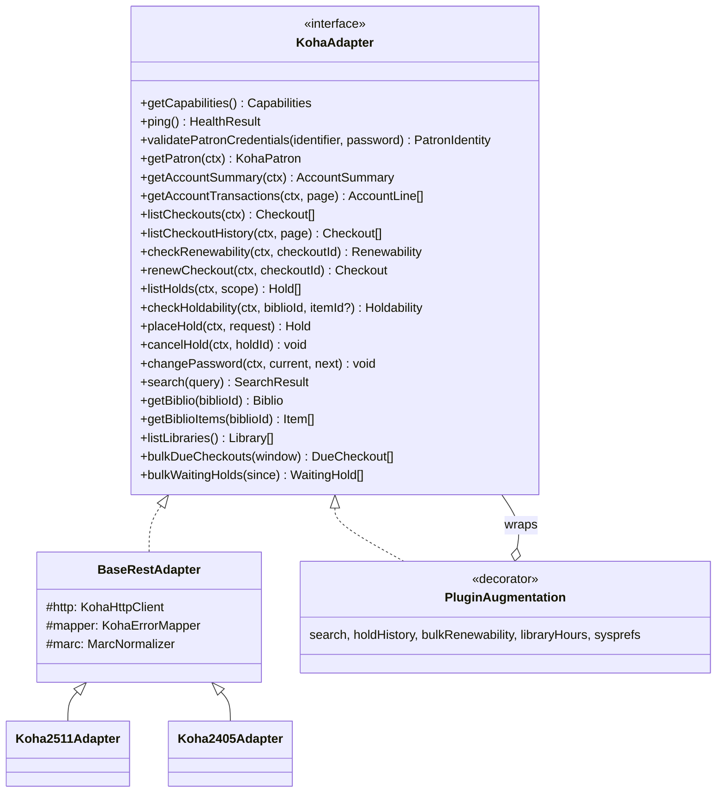

# KOHA_INTEGRATION — Koha Entegrasyon Katmanı

> Durum: **Taslak v0.2.** Kararlar: **MirAkıl Koha eklentisi geliştirilecek (D1)** ·
> **desteklenen en düşük Koha sürümü 24.05 (D2)**. Bu doküman Gateway'in Koha sunucularıyla nasıl konuştuğunu, hangi
> işlemlerin Koha core REST API ile doğrudan yapılabildiğini ve hangileri için MirAkıl Koha
> Plugin'i gerektiğini tanımlar.
>
> ⚠️ **Doğrulama notu:** Endpoint'lerin hangi Koha sürümünde eklendiği bilgisi bilinen Koha geliştirme
> geçmişine dayanır ve "≈" ile işaretlenmiştir. En düşük sürüm 24.05 olduğundan §3'teki core uçların
> büyük çoğunluğunun desteklenen tüm sürümlerde bulunması beklenir. Faz 0'da **koha-testing-docker (KTD)**
> ile 24.05, 24.11, 25.05 ve 25.11 üzerinde tek tek doğrulanacak ve bu doküman güncellenecektir. Mimari bu belirsizliği
> **capability tespiti** ile tolere edecek şekilde tasarlanmıştır.

## 1. Bağlantı Modeli

```
Gateway ──HTTPS──► https://KOHA-SERVER/api/v1/...
                     │
                     ├─ OAuth2 client_credentials  (POST /api/v1/oauth/token)   ← tercih edilen
                     └─ HTTP Basic (RESTBasicAuth)                              ← yalnızca fallback
```

- Her kurum Koha'da **"MirAkıl Mobile Gateway" adlı bir servis hesabı (personel patron)** oluşturur ve
  bu hesap için API key (client_id / client_secret) üretir. Gerekli syspref: `RESTOAuth2ClientCredentials = Enable`.
- Client secret yalnızca Gateway DB'sinde şifreli tutulur ([DATABASE.md §5](./DATABASE.md#5-şifreleme)).
- Koha access token Redis'te tenant başına cache'lenir, süresi dolmadan yenilenir; 401 alınırsa
  bir kez yenilenip tekrar denenir.
- Bağlantı ayarları: timeout (varsayılan 8 sn), tenant başına max eşzamanlı istek (varsayılan 10),
  retry yalnızca idempotent GET'lerde (2 deneme, jitter'lı backoff), circuit breaker (5 ardışık
  hata → 30 sn açık).
- Tüm isteklere `X-Correlation-Id` ve `User-Agent: MirAkil-Gateway/<ver>` eklenir.
- `RESTPublicAPI` açık olsa bile Gateway **public uçlara güvenmez**; tutarlılık için servis
  hesabıyla staff uçlarını kullanır (public uçlar kullanıcı oturumu/cookie gerektirir).

### 1.1 Servis hesabı için önerilen minimum yetkiler

| Koha yetkisi | Neden | Not |
|---|---|---|
| `catalogue` | Bibliyografik kayıt ve nüsha okuma | Zorunlu |
| `borrowers: list_borrowers` / `edit_borrowers` | Patron bilgisi, extended attributes, şifre değiştirme, hesap (borç) okuma | Şifre değişimi için `edit_borrowers` gerekir (≈) |
| `borrowers: view_borrower_infos_from_any_libraries` | Çok şubeli kurumlarda tüm patronları görme | `IndependentBranches` kullanan kurumlarda gerekli |
| `circulate: circulate_remaining_permissions` | Ödünç listesi, yenilenebilirlik, yenileme | |
| `reserveforothers: place_holds` | Patron adına rezervasyon | |
| `reserveforothers: modify_holds_priority` | (gerekirse) iptal/güncelleme | |
| `updatecharges: remaining_permissions` | Hesap hareketlerini okuma (bazı sürümlerde) | Ödeme fazında |
| `plugins: tool` (yalnızca plugin uçları için) | MirAkıl plugin rotaları | Plugin rotalarına özel yetki tanımı yapılabilir |

Bağlantı testi bu yetkileri **örnek salt-okunur çağrılarla** sınar ve eksikleri panelde uyarı olarak gösterir.

### 1.2 Pilot / entegrasyon test ortamı gereksinimleri

Pilot kurumun sağlayacağı Koha test ortamında (üretimden ayrı) bulunması gerekenler:

- [ ] Koha sürümü 24.05 veya üzeri, **HTTPS** ile erişilebilir REST API (`/api/v1/`)
- [ ] `RESTOAuth2ClientCredentials` açık; servis hesabı (§1.1 yetkileriyle) ve API anahtarı (client id/secret)
      — secret, MirAkıl'a güvenli kanaldan iletilir ve yalnızca admin panelinden girilir (repoya/e-postaya yazılmaz)
- [ ] Pilot sunucunun sabit çıkış IP'si Koha test ortamında allowlist'te
- [ ] MirAkıl Koha eklentisinin kurulabilmesi (`UseKohaPlugins` açık, eklenti yükleme yetkisi)
- [ ] Test patronları: farklı kategoriler (öğrenci, akademisyen, personel), en az biri kısıtlı (debarred),
      biri üyeliği dolmuş, biri borçlu; fakülte/bölüm extended attribute'ları dolu
- [ ] Test materyalleri: farklı materyal türleri, birden çok şube, ödünç verilebilir / verilemez nüshalar
- [ ] Dolaşım kuralları: yenileme limiti, rezervasyon kuralları, gecikme cezası tanımlı
- [ ] Senaryolar için veri: aktif ödünç (yaklaşan, bugün iade, gecikmiş), rezervasyonlu materyal,
      hazır bekleyen rezervasyon, açık borç
- [ ] Arama motoru bilgisi (Zebra / Elasticsearch) ve MARC formatı (MARC21 / UNIMARC)
- [ ] Test sırasında dolaşım işlemi (ödünç verme/iade) yapabilecek bir personel kullanıcısı (senaryo hazırlamak için)

## 2. Adapter Mimarisi



- **`ctx: PatronContext`** = `{ tenantId, kohaPatronId, correlationId }`. Adapter metotları serbest
  `patronId` almaz; context yalnızca auth katmanı tarafından oluşturulabilir (branded type).
- **Adapter seçimi:** `tenant_koha_connections.adapter_key = auto` ise tespit edilen sürüme göre:
  - `≥ 25.05` → `Koha2511Adapter` (en güncel davranış seti)
  - `24.05 – 24.11` → `Koha2405Adapter`
  - `< 24.05` → **desteklenmez**: bağlantı testi `KOHA_VERSION_UNSUPPORTED` döndürür ve tenant aktifleştirilemez.
    `LegacyKohaAdapter` / ILS-DI geliştirilmeyecektir (D2).
  - Yeni bir Koha sürümü çıktığında önce contract testleri çalıştırılır; davranış farkı yoksa mevcut
    adapter'a eşlenir, fark varsa yeni adapter alt sınıfı eklenir.
- **Davranış seçimi capability'lere göredir.** Örn. `Koha2405Adapter.listHolds('past')` önce
  `capabilities.holds.history`'e bakar; plugin varsa plugin'i, yoksa `FEATURE_UNSUPPORTED` döndürür.
- **`PluginAugmentation` decorator'ı:** Plugin kurulu tenant'larda belirli metotları plugin
  uçlarına yönlendirir; diğerlerini alttaki adapter'a bırakır.
- **Contract testleri:** `packages/koha-client/test/contract/*` her adapter için aynı test setini,
  KTD üzerinde gerçek Koha'ya karşı çalıştırır. Gerçek yanıtlar `fixtures/{version}/` altında saklanır.

### 2.1 Sürüm ve yetenek tespiti

1. Plugin varsa: `GET /api/v1/contrib/mirakil/info` → kesin Koha sürümü, `marcflavour`, arama motoru,
   ilgili syspref'ler.
2. Plugin yoksa:
   - `GET /api/v1/` (OpenAPI spec) → **mevcut path'lerin listesi** üzerinden capability çıkarımı
     (ör. `/auth/password/validation` var mı, `/checkouts/{id}/allows_renewal` var mı).
   - Sürüm için OPAC ana sayfasındaki `<meta name="generator" content="Koha xx.xx...">` okunur (≈).
3. Sonuç `tenant_koha_connections.capabilities` (JSONB) olarak saklanır; `tenant-health` job'ı
   günde bir ve admin "Bağlantıyı test et" dediğinde yeniler.

Örnek capability seti:

```json
{
  "auth.passwordValidation": true,
  "patron.extendedAttributes": true,
  "patron.passwordChange": true,
  "loans.list": true,
  "loans.history": true,
  "loans.renewability": true,
  "loans.renew": true,
  "holds.list": true,
  "holds.create": true,
  "holds.cancel": true,
  "holds.pickupLocations": true,
  "holds.history": false,
  "account.summary": true,
  "account.transactions": false,
  "catalog.search": false,
  "catalog.biblio": true,
  "catalog.items": true,
  "libraries.list": true,
  "libraries.hours": false,
  "sysprefs.read": false
}
```

**Mobil'e dönen efektif feature** = `adminFlag && capabilityKarşılığı`.

## 3. Fonksiyon Matrisi — Koha REST API ile Doğrudan Yapılabilenler

Yollar `https://KOHA-SERVER/api/v1` altındadır.

| Gateway fonksiyonu | Koha core REST API | Sürüm (≈) | Durum |
|---|---|---|---|
| Servis token alma | `POST /oauth/token` (`grant_type=client_credentials`) | 20.05+ | ✅ Doğrudan |
| Kullanıcı adı / kart no + şifre doğrulama | `POST /auth/password/validation` (`identifier` veya `userid`/`cardnumber` + `password`) → `patron_id`, `cardnumber`, `userid` | 22.11+ (`identifier` ≈ 23.11+) | ✅ Doğrudan — **KOHA login'in temeli** |
| Profil | `GET /patrons/{patron_id}` (+ `x-koha-embed: extended_attributes`) | 20.05+ | ✅ Doğrudan |
| Kullanıcı kategorisi adı | `GET /patron_categories` | ≈ 23.05+ | ✅ / eski sürümde tenant eşleme tablosu |
| Fakülte / bölüm | Patron extended attributes | — | ✅ (attribute kodu tenant ayarında eşlenir) |
| Kısıtlamalar (debarment) | Patron nesnesindeki `restricted`/debarment alanları | — | ✅ (alan adları sürüme göre değişebilir) |
| Borç özeti + açık kalemler | `GET /patrons/{patron_id}/account` → `balance`, `outstanding_debits.lines`, `outstanding_credits` | 18.11+ | ✅ Doğrudan |
| Tüm borç/ödeme hareketleri | `GET /patrons/{patron_id}/account/debits` / `credits` | ≈ 23.11+ | ⚠️ Sürüme bağlı → plugin fallback |
| Aktif ödünçler | `GET /checkouts?patron_id={id}` (+ `x-koha-embed: item,item.biblio` sürüme göre) | 18.05+ | ✅ Doğrudan |
| Ödünç geçmişi | `GET /checkouts?patron_id={id}&checked_in=true` | ≈ 21.11+ | ✅ (patron gizlilik ayarına tabi) |
| Yenilenebilirlik kontrolü | `GET /checkouts/{checkout_id}/allows_renewal` → `allows_renewal`, `max_renewals`, `current_renewals`, `error` | 19.05+ | ✅ Doğrudan |
| Yenileme | `POST /checkouts/{checkout_id}/renewal` (yeni sürümlerde `/renewals`) | 19.05+ | ✅ Doğrudan |
| Aktif rezervasyonlar | `GET /holds?patron_id={id}` | 18.05+ | ✅ Doğrudan |
| Rezervasyon oluşturma | `POST /holds` (`patron_id`, `biblio_id` veya `item_id`, `pickup_library_id`, `expiration_date`) | 18.05+ (pickup kontrolleri ≈ 20.05+) | ✅ Doğrudan |
| Teslim şubeleri | `GET /biblios/{id}/pickup_locations?patron_id=`, `GET /items/{id}/pickup_locations?patron_id=` | ≈ 21.05+ | ✅ Doğrudan |
| Rezervasyon iptali | `DELETE /holds/{hold_id}` | 18.05+ | ✅ (iptal politikası Gateway'de kontrol edilir; bkz. §6) |
| Geçmiş rezervasyonlar (teslim alındı / iptal / süresi doldu) | old_reserves — core'da kısıtlı/sürüme bağlı | — | ⚠️ **Plugin** |
| Şifre değiştirme (staff) | `POST /patrons/{patron_id}/password` (`password`, `password_2`) | 19.05+ | ✅ (mevcut şifre önce `/auth/password/validation` ile doğrulanır) |
| Bibliyografik kayıt | `GET /biblios/{biblio_id}` — `Accept: application/marc-in-json` (veya `marcxml`, `application/json`) | 20.05+ | ✅ Doğrudan (MARC normalize edilir) |
| Nüsha listesi | `GET /biblios/{biblio_id}/items` | ≈ 21.05+ | ✅ Doğrudan |
| Nüsha ödünç/durum bilgisi | `GET /items/{id}` + `x-koha-embed: checkout` (sürüme göre) | ≈ 21.05+ | ✅ / kısmi |
| Materyal türü adları | `GET /item_types` | ≈ 22.11+ | ✅ / tenant cache |
| Yer/koleksiyon adları (LOC, CCODE, NOT_LOAN) | `GET /authorised_value_categories/{cat}/authorised_values` | ≈ 23.05+ | ✅ / plugin fallback |
| Şubeler (adres, telefon, e-posta) | `GET /libraries` | 18.11+ | ✅ Doğrudan |
| Toplu "iadesi yaklaşan" (worker) | `GET /checkouts?q={"due_date":{"-between":[from,to]}}&_per_page=...` | ≈ 20.05+ (`q` filtresi) | ✅ Doğrudan — sayfalı |
| Toplu "hazır rezervasyon" (worker) | `GET /holds?q={"status":"W","waiting_date":{">=":since}}` | ≈ 20.05+ | ✅ Doğrudan |
| Üyelik bitişi yaklaşanlar | `GET /patrons?q={"expiry_date":{"-between":[...]}}` | 20.05+ | ✅ (yalnızca mobil kullanıcılarla kesişim alınır) |

## 4. Eklenti veya Özel Endpoint Gerektirenler

> Eklenti **önerilen** kurulumdur ancak zorunlu değildir: eklentisi olmayan kurum "sınırlı mod"da çalışır
> (aşağıdaki fallback sütunu). Pilot kurumlarda eklenti kurulu olacaktır.

| İhtiyaç | Neden core REST yetmiyor | Plugin endpoint (öneri) | Plugin yoksa fallback |
|---|---|---|---|
| **Katalog arama** (tüm alanlar, başlık, yazar, konu, ISBN, ISSN, yer no) | Core REST tam metin arama sunmuyor; `GET /biblios` yalnızca kolon filtresi | `GET /contrib/mirakil/search?q=&idx=&page=&limit=` (`Koha::SearchEngine` Zebra/ES) | SRU (Zebra `z3950`/SRU sunucusu açıksa) → OPAC OpenSearch RSS (`opac-search.pl?format=rss`) → yoksa `catalogSearch=false` |
| Arama sonucunda uygun kopya sayısı | Arama motoru yanıtına ek sorgu gerekir | Plugin arama yanıtına dahil eder | Sonuç başına `GET /biblios/{id}/items` (sayfa başına limitli, cache'li) |
| Toplu yenilenebilirlik (N ödünç için tek çağrı) | Core'da tek tek `allows_renewal` | `GET /contrib/mirakil/patrons/{id}/renewability` | Paralel tekil çağrılar (bulkhead limitli) |
| Geçmiş rezervasyonlar | old_reserves REST'te tutarlı değil | `GET /contrib/mirakil/patrons/{id}/holds/history` | Yalnızca aktif rezervasyonlar |
| Syspref okuma (`OpacPasswordChange`, `OpacRenewalAllowed`, `minPasswordLength`, `OPACHoldsIfAvailableAtPickup`, `ReservesMaxPickUpDelay`...) | Syspref REST endpoint'i yok | `GET /contrib/mirakil/info` (beyaz liste) | Admin panelde manuel feature flag / politika |
| Şifre politikası (patron kategori bazlı uzunluk/güç) | Doğrudan okunamaz | `info` içinde kategori bazlı kurallar | Koha'nın `POST /patrons/{id}/password` hatası map edilir |
| Hesap hareket geçmişinin tamamı (eski sürümler) | `account/debits` yeni | `GET /contrib/mirakil/patrons/{id}/account/lines` | Yalnızca açık kalemler |
| Çalışma saatleri | Core'da tutarlı API yok | (ileride) plugin | **Gateway DB** (`tenant_library_hours`, panelden) — MVP |
| Duyurular (OPAC haberleri) | `additional_contents` REST'i sürüme bağlı | `GET /contrib/mirakil/news` (opsiyonel içe aktarım) | **Gateway DB** (panelden) — MVP |
| Toplu bildirim verisi (performans) | Büyük kurumlarda sayfalı `checkouts` taraması ağır olabilir | `GET /contrib/mirakil/notices/due?from=&to=&patron_ids=` | Core `q` filtresi ile sayfalı tarama |
| Kesin Koha sürümü | Core'da sürüm endpoint'i yok | `info` | OPAC `meta generator` |
| Kapak görseli | Local cover REST'i sınırlı | (gerekmez) | `/cgi-bin/koha/opac-image.pl?biblionumber=` veya ISBN ile OpenLibrary/Google Books (Gateway proxy) |
| LDAP/SAML/OIDC ile giriş yapan kullanıcıyı patron'a eşleme | Eşleme için patron araması gerekir | (gerekmez) | `GET /patrons?userid=` / `cardnumber=` / `email=` |

### 4.1 MirAkıl Koha Plugin (öneri)

- Paket: `Koha::Plugin::Com::MirAkil::Mobile` (`koha-plugin/` dizini, `.kpz` olarak dağıtılır).
- Koha plugin API rotaları: `api_namespace = 'mirakil'` → `/api/v1/contrib/mirakil/...`.
- Kimlik doğrulama Koha'nın kendi REST auth'u (aynı OAuth2 servis hesabı) + plugin içinde yetki kontrolü.
- **Yalnızca okuma ve sınırlı, beyaz listeli** işlevler sunar; Koha DB'sine dışarıdan bağlantı açılmaz
  (plugin Koha process'i içinde çalışır).
- Sürümleme: semver; Gateway plugin sürümünü `info`'dan okur ve uyumluluk matrisi tutar.
- Desteklenen Koha sürümleri: **24.05 ve üzeri** (eklentinin `minimum_version` meta verisi `24.05`).
- Eklenti yalnızca Koha'nın kendi Perl API'lerini (`Koha::Patrons`, `Koha::Checkouts`, `Koha::Holds`,
  `Koha::SearchEngine`, `C4::Context->preference`) kullanır; doğrudan SQL yazmaz (sürüm uyumu için).
- Kurumlar için kurulum rehberi `docs/koha-plugin-install.md` (Faz 2).

## 5. Katalog Araması

```
mobil → GET /mobile/v1/catalog/search?q=..&field=title
          │
          ▼
   CatalogService ── SearchStrategy seçimi (capability):
          ├─ PluginSearchStrategy   (tercih)  → /contrib/mirakil/search
          ├─ SruSearchStrategy      (fallback) → CQL: dc.title="..." / bath.isbn=...
          └─ OpacRssSearchStrategy  (son çare) → opac-search.pl?idx=ti&q=..&format=rss
          │
          ▼
   MarcNormalizer (MARC21 | UNIMARC) → SearchResultDto
```

Alan eşlemesi (Koha `idx` / CCL):

| Gateway `field` | Koha idx (Zebra/ES) | MARC21 | UNIMARC |
|---|---|---|---|
| `any` | `kw` | — | — |
| `title` | `ti` | 245, 246, 130, 240 | 200$a, 500 |
| `author` | `au` | 100, 110, 700, 710 | 700, 701, 710 |
| `subject` | `su` | 6XX | 6XX |
| `isbn` | `nb` | 020$a | 010$a |
| `issn` | `ns` | 022$a | 011$a |
| `callNumber` | `callnum` (`lcn`) | 952$o (item) | 995$k (item, kuruma göre) |

Sonuç kartı için gerekli alanlar: başlık, yazar, yayın yılı (MARC21 264$c/260$c, 008/07-10),
materyal türü (942$c / item type), yer no, kapak, uygun/toplam nüsha.

## 6. İş Kuralları (Gateway tarafı)

1. **Sahiplik doğrulaması:** `renew(loanId)` → opak ID çözülür → `GET /checkouts/{id}` →
   `patron_id === ctx.kohaPatronId` değilse `RESOURCE_NOT_FOUND` (403 değil; varlık sızdırılmaz).
   Aynı kural `cancelHold` için geçerlidir.
2. **Yenileme akışı:** `allows_renewal` → izin yoksa `error` map edilir ve Koha'ya POST atılmaz →
   izin varsa `POST renewal` → başarıda cache invalidate + audit log.
3. **Rezervasyon iptali:** Koha REST staff yetkisiyle her durumdaki rezervasyonu silebilir; bu nedenle
   Gateway **OPAC kurallarını** uygular: `READY` (W) veya `IN_TRANSIT` (T) rezervasyonlar için iptal,
   tenant politikası (`allowCancelWaitingHolds`, varsayılan `false`) izin vermedikçe engellenir.
   Yeni sürümlerde "iptal talebi" (cancellation request) desteği capability ile değerlendirilir.
4. **Rezervasyon oluşturma:** Teslim şubesi `pickup_locations` yanıtında değilse istek reddedilir;
   kayıt düzeyi (biblio) rezervasyon varsayılandır, nüsha düzeyi tenant politikasıyla açılır.
5. **Şifre değiştirme:** `passwordChange` flag'i + (plugin varsa) `OpacPasswordChange` syspref'i →
   mevcut şifre `/auth/password/validation` ile doğrulanır → `POST /patrons/{id}/password` →
   başarıda kullanıcının **diğer tüm oturumları iptal edilir**.
6. **Gizlilik:** Ödünç geçmişi patron'un `privacy` ayarına tabidir; Gateway geçmişi kendi DB'sine yazmaz.
7. **Saat dilimi:** Koha `due_date` (datetime) tenant saat dilimine göre `dueDate` (gün) ve
   `daysRemaining`'e çevrilir.

## 7. Normalizasyon

- `KohaCheckout → LoanDto`, `KohaHold → HoldDto`, `KohaPatron → ProfileDto`, `MARC → BiblioDto`.
- Koha alan adları (`biblio_id`, `patron_id`, `borrowernumber`) DTO'lara sızmaz; ID'ler opak ID'ye çevrilir.
- MARC normalizer kuruma özel alan eşlemelerine izin verir (`tenant.config.marcOverrides`), ör.
  fakülte yayınlarında farklı yer no alanı.

## 8. Hata Eşleme (Error Mapper)

Koha ham yanıtı **her zaman** `koha_api_errors` tablosuna ve log'a (maskelenmiş) yazılır; kullanıcıya
yalnızca Gateway `ErrorCode` + yerelleştirilmiş mesaj gider.

### 8.1 Yenileme (`allows_renewal.error` / renewal POST hatası)

| Koha kodu | Gateway kodu | Kullanıcı mesajı (tr) |
|---|---|---|
| `too_many` | `LOAN_RENEWAL_TOO_MANY` | Bu materyal için izin verilen en fazla yenileme sayısına ulaşıldı. |
| `too_unseen` | `LOAN_RENEWAL_NOT_ALLOWED` | Bu materyalin yenilenmesi için kütüphaneye getirilmesi gerekiyor. |
| `on_reserve` | `LOAN_RENEWAL_ON_HOLD` | Bu materyal başka bir okuyucu tarafından rezerve edildiği için yenilenemiyor. |
| `too_soon` / `auto_too_soon` | `LOAN_RENEWAL_TOO_SOON` | Bu materyal henüz yenilenemez. Yenileme {date} tarihinden itibaren yapılabilir. |
| `overdue` | `LOAN_RENEWAL_OVERDUE` | Gecikmiş materyaller uygulama üzerinden yenilenemiyor. Lütfen kütüphaneye başvurun. |
| `restriction` / `debarred` | `LOAN_RENEWAL_RESTRICTED` | Hesabınızdaki kısıtlama nedeniyle yenileme yapılamıyor. |
| `auto_too_much_oweing` | `LOAN_RENEWAL_FINES` | Borcunuz izin verilen sınırı aştığı için yenileme yapılamıyor. |
| `auto_account_expired` | `LOAN_RENEWAL_ACCOUNT_EXPIRED` | Üyelik süreniz dolduğu için yenileme yapılamıyor. |
| `auto_renew` | `LOAN_RENEWAL_AUTO` | Bu materyal otomatik yenileme kapsamında; ayrıca yenilemeniz gerekmiyor. |
| `auto_too_late` | `LOAN_RENEWAL_NOT_ALLOWED` | Otomatik yenileme süresi geçtiği için yenileme yapılamıyor. |
| `onsite_checkout` | `LOAN_RENEWAL_NOT_ALLOWED` | Kütüphane içi kullanım için verilen materyaller yenilenemez. |
| `item_denied_renewal` | `LOAN_RENEWAL_NOT_ALLOWED` | Bu materyalin yenileme işlemi kütüphane politikaları nedeniyle gerçekleştirilemiyor. |
| `no_checkout` / `item_issued_to_other_patron` | `RESOURCE_NOT_FOUND` | Ödünç kaydı bulunamadı. |
| *(bilinmeyen)* | `LOAN_RENEWAL_NOT_ALLOWED` | Bu materyalin yenileme işlemi kütüphane politikaları nedeniyle gerçekleştirilemiyor. |

### 8.2 Rezervasyon (`POST /holds` 403/409 yanıtındaki neden)

| Koha nedeni | Gateway kodu | Kullanıcı mesajı (tr) |
|---|---|---|
| `tooManyReserves`, `tooManyReservesToday` | `HOLD_TOO_MANY` | Yapabileceğiniz en fazla rezervasyon sayısına ulaştınız. |
| `tooManyHoldsForThisRecord` | `HOLD_TOO_MANY` | Bu eser için en fazla rezervasyon sayısına ulaştınız. |
| `alreadyReserved`, `itemAlreadyOnHold` | `HOLD_ALREADY_EXISTS` | Bu materyal için zaten bir rezervasyonunuz var. |
| `alreadypossession` | `HOLD_ALREADY_EXISTS` | Bu materyal zaten sizde ödünçte. |
| `ageRestricted` | `HOLD_AGE_RESTRICTED` | Bu materyal yaş sınırlaması nedeniyle rezerve edilemiyor. |
| `notReservable`, `noReservesAllowed` | `HOLD_NOT_ALLOWED` | Bu materyal için rezervasyon yapılamıyor. |
| `cannotReserveFromOtherBranches`, `branchNotInHoldGroup`, `pickupNotInHoldGroup` | `HOLD_PICKUP_LOCATION_INVALID` | Seçtiğiniz şube için bu materyale rezervasyon yapılamıyor. |
| `libraryNotPickupLocation`, `libraryNotFound`, `cannotBeTransferred` | `HOLD_PICKUP_LOCATION_INVALID` | Seçtiğiniz şube teslim noktası olarak kullanılamıyor. |
| `damaged` | `HOLD_NOT_ALLOWED` | Bu nüsha hasarlı olduğu için rezerve edilemiyor. |
| patron kısıtlı / expired | `HOLD_PATRON_RESTRICTED` | Hesabınızdaki kısıtlama nedeniyle rezervasyon yapılamıyor. |
| *(bilinmeyen)* | `HOLD_NOT_ALLOWED` | Bu materyal için rezervasyon yapılamıyor. |

### 8.3 Genel HTTP

| Koha | Gateway |
|---|---|
| 400 (`errors[]`) | `VALIDATION_ERROR` (log'da ayrıntı) |
| 401 (servis token) | Token yenile + 1 kez tekrar; yine 401 → `KOHA_UNAVAILABLE` + admin alarmı |
| 403 (yetki eksik) | `KOHA_UNAVAILABLE` + admin uyarısı ("servis hesabı yetkisi eksik") |
| 404 | `RESOURCE_NOT_FOUND` |
| 409 | İşlem bazlı eşleme |
| 5xx, bağlantı hatası | `KOHA_UNAVAILABLE` (okuma işlemlerinde cache varsa cache + `meta.source=cache`) |
| Timeout | `KOHA_TIMEOUT` |

## 9. Test Stratejisi

- **Unit:** mapper, normalizer, error mapper (fixture tabanlı).
- **Contract:** Her adapter, KTD'de ayağa kaldırılan Koha sürümlerine karşı (`24.05`, `24.11`, `25.05`,
  `25.11`), eklentili ve eklentisiz. CI'da nightly.
- **Sürüm reddi:** 23.11 KTD'ye karşı bağlantı testinin `KOHA_VERSION_UNSUPPORTED` döndürdüğü doğrulanır.
- **Kayıt/yeniden oynatma:** Gerçek kurum Koha'larından (izinle, anonimleştirilmiş) alınan yanıt örnekleri.
- **Kaos:** Koha yavaş/çöken senaryolarda circuit breaker ve diğer tenant'ların etkilenmediği doğrulanır.
