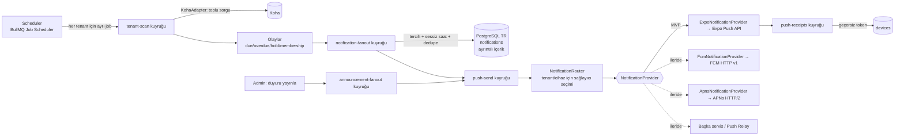

# NOTIFICATIONS — Bildirim Mimarisi

> Durum: **Taslak v0.2.** Hedef ölçek: 100+ kurum, kurum başına on binlerce kullanıcı, yüz binlerce
> aktif ödünç. Koha sunucuları yorulmamalı (kurum başına sınırlı sayıda eşzamanlı istek), bildirimler
> **tekrarsız** olmalı.
>
> **Onaylanan kararlar** ([DECISIONS.md](./DECISIONS.md)):
> - MVP ve pilotta **Expo Push** kullanılacak, ancak mimari **Expo'ya bağımlı olmayacak**.
>   `NotificationProvider` soyut katmanı kurulacak; ileride doğrudan FCM/APNs'e veya başka bir servise
>   geçmek **mobil uygulamayı yeniden tasarlamayı gerektirmeyecek**.
> - Push içeriği **mümkün olduğunca kişisel veri taşımayacak** (kitap adı, kullanıcı adı, ceza tutarı yok).
> - Expo üzerinden geçen veriler KVKK açısından ayrıca hukuki olarak değerlendirilecek.

## 1. Temel İlkeler

1. **İki ayrı kanal vardır:**
   - **Push kanalı** (Expo / FCM / APNs; sunucuları yurt dışında): yalnızca **genel metin + opak kimlik**
     taşır. Push yalnızca "uygulamada yeni bir şey var" sinyalidir.
   - **Uygulama içi kanal** (Gateway API, Türkiye'de barındırılan backend): bildirimin **ayrıntılı
     içeriği** (hangi kitap, kaç gün kaldı) yalnızca kullanıcı uygulamayı açıp kimliği doğrulanmış
     bir istek yaptığında `GET /mobile/v1/notifications` ile gelir.
2. **Sağlayıcıdan bağımsızlık:** Sağlayıcıya özgü kod yalnızca backend'deki `NotificationProvider`
   implementasyonlarında ve mobildeki tek bir `PushRegistration` modülünde bulunur. Bildirim modeli,
   dedupe, tercihler, şablonlar ve bildirim ekranları sağlayıcıyı bilmez.
3. **Mobil uygulama baştan "çıkışa hazır" yazılır:** Expo token'ının yanında cihazın **yerel (native)
   push token'ı** (Android: FCM registration token, iOS: APNs device token) da alınıp backend'e
   kaydedilir. Sağlayıcı değiştirmek **sunucu tarafındaki bir yapılandırma değişikliğidir**; uygulama
   güncellemesi gerekmez (§6).
4. **Kendi payload sözleşmemiz:** Push'un `data` alanı bizim versiyonlu şemamızdır
   (`MirakilPushData v1`). Mobil uygulama bildirimin hangi sağlayıcıdan geldiğini ayırt etmez.

## 2. Bileşenler



> Not: FCM ve APNs'e doğrudan geçilse bile veri yine Google/Apple sunucularından (yurt dışı) geçer.
> Asıl koruma **sağlayıcı seçimi değil, payload minimizasyonudur** (§5).

## 3. Veri Modeli (özet)

Ayrıntı: [DATABASE.md](./DATABASE.md).

- `notifications(id, tenant_id, user_id, type, dedupe_key, title, body, data, push_template, scheduled_for, read_at, created_at)`
  — `title`/`body`: **uygulama içi** ayrıntılı metin (yalnızca Türkiye'deki DB'de);
  `push_template`: push'ta kullanılacak **genel** şablon anahtarı.
- `notification_deliveries(notification_id, device_id, provider, status, provider_message_id, attempts, error_code)`
- `devices(id, tenant_id, user_id, installation_id, platform, expo_push_token, native_push_token, native_token_type, push_enabled, ...)`
- `notification_preferences(user_id, due_reminders, due_reminder_days[], overdue, holds, announcements, membership, quiet_hours_*)`
- `tenant_notification_settings` (tenant config içinde): `provider` (`expo` | `fcm_apns` | `relay`), hatırlatma saatleri, gecikme günleri.

### 3.1 Bildirim tipleri

| Tip | Tetik | Varsayılan zaman | Tercih anahtarı |
|---|---|---|---|
| `DUE_SOON` | İade tarihine N gün (varsayılan 3 ve 1) | 10:00 (tenant saat dilimi) | `dueReminders` + `dueReminderDays` |
| `DUE_TODAY` | İade günü | 09:00 | `dueReminders` (0 ∈ days) |
| `OVERDUE` | Gecikmenin 1., 3., 7. günü (tenant ayarı) | 10:00 | `overdue` |
| `HOLD_READY` | Rezervasyon hazır (`W`) durumuna geçti | Anında (sessiz saatlere tabi) | `holds` |
| `HOLD_EXPIRING` | Hazır rezervasyonun teslim süresinin bitimine 1 gün | 10:00 | `holds` |
| `MEMBERSHIP_EXPIRING` | Üyelik bitişine 30 ve 7 gün | 10:00 | `membership` |
| `LIBRARY_ANNOUNCEMENT` | Admin "push ile yayınla" | Yayın zamanı | `announcements` |
| `SYSTEM` | Güvenlik (yeni cihazdan giriş), zorunlu güncelleme | Anında | kapatılamaz (yalnızca kritik) |

## 4. NotificationProvider Soyutlaması

### 4.1 Backend arayüzü

```ts
// apps/api/src/modules/notifications/providers/notification-provider.ts

export type NotificationProviderName = 'expo' | 'fcm' | 'apns' | 'relay';

/** Sağlayıcıdan bağımsız mesaj — kişisel veri içermez. */
export interface OutboundPush {
  deliveryId: string;              // notification_deliveries.id (idempotency anahtarı)
  target: DeviceTarget;            // aşağıda
  title: string;                   // genel metin (şablondan)
  body: string;                    // genel metin (şablondan)
  data: MirakilPushDataV1;         // opak kimlikler
  category: NotificationCategory;  // android channel / ios thread için
  badge?: number;                  // okunmamış sayısı (kişisel veri sayılmaz, isteğe bağlı)
  ttlSeconds?: number;
  priority: 'normal' | 'high';
}

export interface DeviceTarget {
  platform: 'ios' | 'android';
  expoPushToken?: string;
  nativePushToken?: string;        // FCM registration token (android) | APNs device token (ios)
}

export interface SendResult {
  deliveryId: string;
  status: 'ACCEPTED' | 'INVALID_TOKEN' | 'RETRYABLE_ERROR' | 'PERMANENT_ERROR';
  providerMessageId?: string;
  errorCode?: string;              // sağlayıcı kodu normalize edilmiş
}

export interface NotificationProvider {
  readonly name: NotificationProviderName;
  /** Bu cihaza bu sağlayıcıyla gönderilebilir mi? (uygun token var mı) */
  supports(target: DeviceTarget): boolean;
  send(batch: OutboundPush[]): Promise<SendResult[]>;
  /** Asenkron teslim durumu sunan sağlayıcılar için (Expo receipts) */
  fetchReceipts?(providerMessageIds: string[]): Promise<SendResult[]>;
  readonly maxBatchSize: number;
}
```

### 4.2 Implementasyonlar

| Provider | Durum | Hedef token | Not |
|---|---|---|---|
| `ExpoNotificationProvider` | **MVP** | `expoPushToken` | Expo Push API, 100'lük batch, receipt kontrolü. Expo'ya FCM v1 servis hesabı ve APNs `.p8` anahtarı EAS üzerinden tanımlanır. |
| `FcmNotificationProvider` | Faz sonrası | Android `nativePushToken` | FCM HTTP v1 (servis hesabı). İsteğe bağlı olarak iOS'u da FCM üzerinden gönderebilir. |
| `ApnsNotificationProvider` | Faz sonrası | iOS `nativePushToken` | APNs HTTP/2, token tabanlı kimlik (`.p8`). |
| `RelayNotificationProvider` | ON_PREMISE için | herhangi | Kurum sunucusundaki Gateway'in MirAkıl merkezi **Push Relay**'ine göndermesi ([DEPLOYMENT.md §5.3](./DEPLOYMENT.md#53-on_premise-için-bildirimler)). |

### 4.3 NotificationRouter

```
provider = tenant.notificationSettings.provider        // 'expo' (MVP varsayılanı)
         ?? global.defaultNotificationProvider
for each device:
  if provider.supports(device) → provider
  else if fallbackProvider?.supports(device) → fallbackProvider   // geçiş dönemi
  else → delivery = SKIPPED_NO_TOKEN
```

- Sağlayıcı seçimi **tenant bazında ve kademeli** değiştirilebilir (ör. önce bir pilot kurum
  doğrudan FCM/APNs'e geçirilir).
- Geçiş dönemi: `fcm_apns` seçiliyken native token'ı olmayan eski cihazlara Expo ile gönderilir.

## 5. Push İçeriği ve Kişisel Veri Minimizasyonu

### 5.1 Kurallar

1. Push `title`/`body` alanlarında **kişisel veri yok**: kitap adı, yazar, kullanıcı adı/soyadı,
   kart numarası, ceza tutarı, şube adı, tarih, kalan gün sayısı **gönderilmez**.
2. `data` alanında **yalnızca opak kimlikler**: Koha ID'si, patron ID'si, e-posta, kullanıcı UUID'si yok.
3. Push başlığı varsayılan olarak uygulama adıdır ("MirAkıl Kütüphane"). Kurumun adı da kullanıcının
   hangi kuruma bağlı olduğunu açığa çıkardığı için **varsayılan olarak kullanılmaz**; tenant ayarı
   ile açılabilir (`pushTitleMode: APP_NAME | TENANT_NAME`).
4. Ayrıntı **yalnızca uygulama içinde**, kimliği doğrulanmış API çağrısıyla gösterilir.
5. Gruplama ve sayılar: "3 materyalinizin…" gibi sayılar yerine tek ve genel metin kullanılır.
6. Duyurular: duyuru başlığı **kişisel veri değildir**, ancak varsayılan olarak yine genel metin
   ("Kütüphanenizden yeni bir duyuru var.") gönderilir; admin, duyuru başlığının push'ta görünmesine
   açıkça izin verebilir (`pushShowTitle`). Duyuru metnine kişisel veri yazılmaması panelde uyarı olarak
   gösterilir.

### 5.2 Push şablonları (tr / en)

| Şablon anahtarı | Türkçe | English |
|---|---|---|
| `push.dueSoon` | Bir materyalinizin iade tarihi yaklaşıyor. Ayrıntılar için uygulamayı açın. | The due date of an item is approaching. Open the app for details. |
| `push.dueToday` | Bugün iade edilmesi gereken bir materyaliniz var. Ayrıntılar için uygulamayı açın. | You have an item due today. Open the app for details. |
| `push.overdue` | İade tarihi geçmiş bir materyaliniz var. Ayrıntılar için uygulamayı açın. | You have an overdue item. Open the app for details. |
| `push.holdReady` | Rezervasyonunuz teslim almaya hazır. Ayrıntılar için uygulamayı açın. | Your hold is ready for pickup. Open the app for details. |
| `push.holdExpiring` | Hazır bekleyen rezervasyonunuzun teslim alma süresi doluyor. | Your hold pickup period is ending soon. |
| `push.membershipExpiring` | Kütüphane üyeliğinizin süresi yakında doluyor. | Your library membership expires soon. |
| `push.announcement` | Kütüphanenizden yeni bir duyuru var. | There is a new announcement from your library. |
| `push.system.newLogin` | Hesabınıza yeni bir cihazdan giriş yapıldı. | Your account was accessed from a new device. |

Şablonlar `packages/i18n` içinde tutulur; dil, cihaz kaydındaki `locale` alanından seçilir.

### 5.3 Payload sözleşmesi — `MirakilPushDataV1`

```json
{
  "v": 1,
  "nid": "nt_01J9X...",          // opak bildirim kimliği (uygulama içi kayıt)
  "t": "DUE_SOON",               // bildirim tipi
  "tc": "ornek-uni",             // tenant kodu (çok kurumlu cihazda doğru oturumu seçmek için)
  "dl": "mirakil://notifications/nt_01J9X..."   // deep link — kişisel veri içermez
}
```

- Deep link her zaman **bildirim kaydına** gider; uygulama `GET /notifications/{nid}` ile ayrıntıyı
  (ilgili ödünç ID'si dahil) çeker ve ilgili ekrana yönlendirir. Böylece push'ta `loanId` bile yoktur.
- `tc` (kurum kodu) kişisel veri değildir ancak kurum bilgisini açığa çıkarır; KVKK değerlendirmesinde
  çıkarılması istenirse kaldırılabilir (uygulama tek aktif oturumla zaten kurumu bilir).
- Şema versiyonludur; mobil uygulama bilinmeyen `v` değerinde yalnızca bildirim listesini açar.

### 5.4 Uygulama içi bildirim (ayrıntılı)

`GET /mobile/v1/notifications` yanıtı (Türkiye'deki backend'den, kimlik doğrulamalı):

```json
{
  "id": "nt_01J9X...",
  "type": "DUE_SOON",
  "title": "İade tarihi yaklaşıyor",
  "body": "\"Suç ve Ceza\" adlı materyalin iade tarihine 3 gün kaldı (10 Ekim 2026).",
  "target": { "screen": "loan", "loanId": "lo_8f3a..." },
  "createdAt": "2026-10-07T07:00:00Z",
  "readAt": null
}
```

## 6. Mobil Taraf — Sağlayıcıdan Bağımsız Kayıt

### 6.1 Token kaydı

`apps/mobile/src/lib/push/` altında tek modül:

```ts
// PushRegistration: uygulamanın geri kalanı yalnızca bunu bilir.
export interface PushRegistration {
  requestPermission(): Promise<PermissionState>;
  getTokens(): Promise<{ expoPushToken?: string; nativePushToken?: string;
                         nativeTokenType: 'fcm' | 'apns' }>;
  onTokenRefresh(cb: (tokens) => void): Unsubscribe;
  onNotificationReceived(cb: (data: MirakilPushDataV1) => void): Unsubscribe;
  onNotificationOpened(cb: (data: MirakilPushDataV1) => void): Unsubscribe;
}
```

- MVP implementasyonu `expo-notifications` kullanır:
  - `getExpoPushTokenAsync()` → Expo token
  - `getDevicePushTokenAsync()` → **native token** (Android FCM, iOS APNs)
- Uygulama **her iki token'ı** `PUT /mobile/v1/devices/current` ile backend'e gönderir:

```json
{
  "installationId": "c0f1...",
  "platform": "android",
  "expoPushToken": "ExponentPushToken[xxxx]",
  "nativePushToken": "fcm-registration-token...",
  "nativeTokenType": "fcm",
  "appVersion": "1.0.0",
  "locale": "tr",
  "permission": "granted"
}
```

- `expo-notifications`, sağlayıcı fark etmeksizin (Expo, doğrudan FCM, doğrudan APNs) gelen bildirimleri
  gösterir ve tıklama olaylarını aynı API ile iletir. Bu nedenle backend'in doğrudan FCM/APNs'e geçmesi
  **mobil kodda değişiklik gerektirmez**; yalnızca backend'in native token'a göndermesi yeterlidir.
- Android bildirim kanalları (`due`, `overdue`, `holds`, `announcements`, `system`) uygulama tarafından
  oluşturulur; FCM/Expo mesajları aynı `channelId` değerlerini kullanır.
- iOS: `aps.alert`, `aps.sound`, `aps.thread-id` = kategori; `data` kendi şemamız.

### 6.2 Çıkış senaryosu (Expo'dan ayrılma) — kontrol listesi

| Adım | Etki alanı | Mobil güncelleme? |
|---|---|---|
| FCM v1 servis hesabı ve APNs `.p8` anahtarı MirAkıl'a ait olarak zaten mevcut (Expo'ya da bunlar verilmiştir) | Altyapı | Hayır |
| `FcmNotificationProvider` + `ApnsNotificationProvider` devreye alınır | Backend | Hayır |
| Pilot tenant'ta `provider = fcm_apns` | Backend config | Hayır |
| Native token'ı olmayan eski cihazlar için Expo fallback | Backend | Hayır |
| Tüm tenant'lar geçirilir, Expo fallback kapatılır | Backend config | Hayır |
| (İsteğe bağlı) Uygulamadan Expo token alma kodu kaldırılır | Mobil | Sonraki rutin sürümde |

> Kural: Uygulama **ilk sürümden itibaren** native token'ı gönderir. Bu sayede geçiş anında mağazada
> güncelleme beklemek gerekmez.

### 6.3 İzin akışı

- Bildirim izni giriş yapıldıktan sonra **açıklama ekranı** ile istenir (iOS'ta ilk ret kalıcıdır).
- KVKK kapsamında bilgilendirme bu ekranda yapılır: "Bildirimler Apple/Google ve bildirim altyapı
  sağlayıcımız üzerinden iletilir; bildirim metinlerinde kişisel bilgileriniz yer almaz."
- Kullanıcı OS düzeyinde izni kapatırsa uygulama açılışında `permission` alanı güncellenir;
  uygulama içi bildirim listesi çalışmaya devam eder.

## 7. Tekrarsızlık (Deduplication)

**Ana mekanizma:** `notifications` üzerinde `UNIQUE (tenant_id, user_id, dedupe_key)` ve
`INSERT ... ON CONFLICT DO NOTHING RETURNING id`. Satır dönmezse bildirim zaten üretilmiştir → push
kuyruğuna **eklenmez**.

`dedupe_key` formatı — olayın kimliğini ve **ilgili tarihi** içerir:

| Tip | dedupe_key |
|---|---|
| `DUE_SOON` | `DUE_SOON:{checkoutId}:{dueDate}:D{n}` → ör. `DUE_SOON:48213:2026-10-10:D3` |
| `DUE_TODAY` | `DUE_TODAY:{checkoutId}:{dueDate}` |
| `OVERDUE` | `OVERDUE:{checkoutId}:{dueDate}:D{n}` |
| `HOLD_READY` | `HOLD_READY:{holdId}:{waitingDate}` |
| `HOLD_EXPIRING` | `HOLD_EXPIRING:{holdId}:{expirationDate}` |
| `MEMBERSHIP_EXPIRING` | `MEMBERSHIP_EXPIRING:{expiryDate}:D{n}` |
| `LIBRARY_ANNOUNCEMENT` | `ANN:{announcementId}` |

- `dedupe_key` yalnızca Türkiye'deki DB'de tutulur; push payload'ına girmez.
- `dueDate` anahtarın parçası olduğundan materyal **yenilenirse** yeni iade tarihi için hatırlatmalar
  bir kez daha üretilir (doğru davranış).
- Aynı checkout için `DUE_SOON` D3 bildirimi, tarama kaç kez çalışırsa çalışsın **yalnızca bir kez** üretilir.
- **Gönderim tarafı:** `notification_deliveries UNIQUE (notification_id, device_id)` + BullMQ
  `jobId = delivery:{notificationId}:{deviceId}` → yeniden denemelerde aynı cihaza ikinci kez gitmez.
- **Aynı gün birden fazla olay:** Kullanıcının aynı gün birden fazla `DUE_SOON` olayı varsa
  **tek push** gönderilir (genel metin aynı olduğu için); uygulama içinde her olay ayrı kayıt olarak görünür.
  Push için ek anahtar: `PUSH_DIGEST:{userId}:{date}:{type}`.
- **Kaçırılan pencere:** Tarama bir gün atlanırsa (Koha erişilemedi) yalnızca **hâlâ geçerli olan en
  yakın** hatırlatma gönderilir (ör. D3 geçtiyse D1); geçmiş hatırlatmalar topluca gönderilmez.

## 8. Tarama Stratejisi (Ölçeklenebilirlik)

### 8.1 Neden "kullanıcı başına sorgu" değil?

10.000 mobil kullanıcılı bir kurumda kullanıcı başına `GET /checkouts` = tarama başına 10.000 Koha
çağrısı. Bunun yerine **tenant başına toplu, tarih aralıklı sorgu** yapılır ve sonuç Gateway'deki mobil
kullanıcılarla kesiştirilir.

### 8.2 `tenant-scan` job'ı

```
her aktif ve notifications=true tenant için:            (Scheduler; tenant başına ayrı job)
  jobId = scan:{tenantId}:{yyyy-mm-ddThh}                ← aynı saat içinde ikinci job oluşmaz
  cron  = saatlik, tenant'a göre dağıtılmış dakika        ← 100 tenant aynı anda Koha'ya yüklenmez

  1. mobilKullanıcılar = bildirimi açık, geçerli cihazı olan kullanıcıların koha_patron_id'leri (RLS)
  2. yaklaşanİadeler = adapter.bulkDueCheckouts({ from: bugün-7, to: bugün+maxHatırlatmaGünü })
        plugin varsa: /api/v1/contrib/mirakil/notices/due   (tek, hafif çağrı)
        yoksa:        GET /api/v1/checkouts?q={"due_date":{"-between":[from,to]}}&_per_page=500 (sayfalı)
  3. filtre: patron_id ∈ mobilKullanıcılar
  4. her ödünç için (tenant saat dilimiyle) kalan gün → tip ve D{n}
  5. hazırRezervasyonlar = adapter.bulkWaitingHolds({ since: sonTarama - 1 saat })
  6. (günde 1) üyelik bitişi: users.membership_expires_at
  7. olaylar 500'lük gruplar halinde notification-fanout kuyruğuna
```

- **Koha koruması:** tenant başına eşzamanlı tarama isteği sınırı (varsayılan 2), sayfalar arası
  küçük bekleme, circuit breaker açıksa job ertelenir.
- **Kuyruk izolasyonu:** BullMQ açık kaynak sürümünde grup bazlı hız sınırı olmadığından, tenant başına
  eşzamanlılık Redis tabanlı semafor ile (`t:{tid}:koha:sem`) sağlanır. Yavaş bir Koha diğer tenant'ları
  bloklamaz.
- **Rezervasyon hazır gecikmesi:** Saatlik tarama en fazla ~1 saat gecikme demektir. Tenant ayarıyla
  15 dakikalık hafif `holds` taraması veya eklentinin Gateway'e webhook göndermesi (sonraki faz).

### 8.3 `notification-fanout` job'ı

```
her olay için:
  tercih kapalıysa → atla
  in-app title/body = i18n şablonu (ayrıntılı; yalnızca DB'de)
  push_template     = genel şablon anahtarı
  INSERT notifications ... ON CONFLICT (tenant_id, user_id, dedupe_key) DO NOTHING RETURNING id
  eklendiyse:
     gönderimZamanı = sessiz saatlere göre ertele
     push digest anahtarı yoksa → kullanıcının aktif cihazları için push-send (delay)
```

### 8.4 `push-send` job'ı

- `NotificationRouter` ile sağlayıcı seçilir, `provider.maxBatchSize`'a göre gruplanır.
- Yeniden deneme: `RETRYABLE_ERROR` için üstel bekleme (5 deneme); `INVALID_TOKEN` tekrar denenmez,
  cihaz geçersizlenir.
- Sonuç `notification_deliveries`'e yazılır (`provider`, `provider_message_id`, `status`).

### 8.5 `push-receipts` job'ı

- Receipt destekleyen sağlayıcılar (Expo) için 15 dk sonra teslim durumu kontrolü.
- `DeviceNotRegistered` / eşdeğeri → `devices.invalidated_at = now()`.

## 9. Cihaz Token Yaşam Döngüsü

| Olay | Davranış |
|---|---|
| Giriş + bildirim izni verildi | `PUT /devices/current` (Expo + native token) |
| Token değişti (OS) | `PushRegistration.onTokenRefresh` → upsert |
| Uygulama açılışı | `last_seen_at` güncelle (günde en fazla 1) |
| Çıkış / Kurum Değiştir | `DELETE /devices/current` → token kullanıcıdan ayrılır |
| Aynı token başka kullanıcıya / tenant'a kaydedildi | Eski kayıt otomatik geçersizlenir (kısmi unique index) — önceki kullanıcının bildirimi yeni kullanıcıya gitmez |
| 90 gün görülmeyen cihaz | Geçersizlenir |
| Sağlayıcı "kayıtlı değil" döndü | Geçersizlenir |

## 10. Duyurular

- Admin panelde `push = true` ile yayınlanan duyuru → `announcement-fanout` → tenant'ın (global duyuruda
  tüm tenant'ların) duyuru tercihi açık kullanıcıları → gruplar halinde insert → push.
- `publish_at` ileri tarihli ise gecikmeli job.
- Push metni varsayılan olarak genel şablondur (§5.1-6).

## 11. KVKK Notları (hukuki değerlendirmeye girdi)

| Veri | Nerede | Not |
|---|---|---|
| Ayrıntılı bildirim içeriği, dedupe anahtarları, tercihler | Türkiye'deki backend DB | Yurt dışına çıkmaz |
| Push token (Expo + native) | Türkiye'deki DB; ayrıca Expo/Apple/Google | Takma adlı (pseudonymous) cihaz tanımlayıcısı |
| Push metni | Expo + Apple/Google | Genel şablon; kişisel veri içermez |
| Push `data` | Expo + Apple/Google | Opak bildirim ID'si, tip, (isteğe bağlı) kurum kodu |
| Teslim durumu (receipt) | Expo → backend | Kişisel veri içermez |

- Doğrudan FCM/APNs'e geçmek de yurt dışına aktarımı ortadan kaldırmaz; bu nedenle aydınlatma metni ve
  yurt dışı aktarım değerlendirmesi (KVKK m.9) her iki senaryoyu da kapsamalıdır.
- Hukuki değerlendirme sonucu daha sıkı bir model gerekirse ("data-only" push + bildirim metninin cihazda
  üretilmesi) mimari buna da izin verir: `OutboundPush.title/body` boş bırakılıp metin mobilde `t` alanından
  yerel olarak oluşturulabilir (iOS'ta Notification Service Extension gerekir — ayrı iş kalemi).

## 12. Gözlemlenebilirlik

- Metrikler: `scan_duration_seconds{tenant}`, `koha_requests_total{tenant,op,status}`,
  `notifications_created_total{type}`, `push_sent_total{provider,status}`, kuyruk derinliği ve gecikmesi.
- Alarmlar: tenant taraması 3 kez üst üste başarısız, push hata oranı > %5, kuyruk gecikmesi > 15 dk.
- Panel "Push durumu" sayfası: tenant bazlı sağlayıcı, gönderilen/başarılı/başarısız/geçersiz token sayıları,
  native token'ı olan cihaz oranı (geçişe hazırlık göstergesi).

## 13. Test Senaryoları

- Aynı tarama iki kez çalıştığında ikinci çalıştırma 0 bildirim üretir.
- Yenilenen ödünç için eski D3 tekrar gönderilmez; yeni iade tarihi için D3 bir kez gönderilir.
- Sessiz saatlerdeki `HOLD_READY` sabaha ertelenir.
- Kapalı tercih tipinde bildirim üretilmez.
- Push token başka kullanıcıya geçtiğinde eski kullanıcının bildirimi gitmez.
- **Push payload'ında kişisel veri yok:** sözleşme testi, `OutboundPush` içinde kitap adı / ad / tutar /
  Koha ID desenlerini arar; bulursa test kırılır.
- Aynı bildirim `ExpoNotificationProvider` ve `FcmNotificationProvider` (sahte sunucu) ile gönderildiğinde
  mobilin aldığı `data` birebir aynıdır.
- Koha erişilemezken job ertelenir, diğer tenant'lar etkilenmez.
