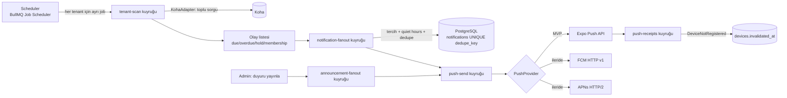

# NOTIFICATIONS — Push Bildirim Mimarisi

> Durum: **Taslak v0.1.** Hedef ölçek: 100+ kurum, kurum başına on binlerce kullanıcı, yüz binlerce
> aktif ödünç. Koha sunucuları korunmalı (kurum başına sınırlı eşzamanlılık), bildirimler **tekrarsız**
> olmalı.

## 1. Bileşenler



## 2. Veri Modeli (özet)

Ayrıntı: [DATABASE.md](./DATABASE.md).

- `notifications(id, tenant_id, user_id, type, dedupe_key, title, body, data, scheduled_for, read_at, created_at)`
- `notification_deliveries(notification_id, device_id, status, provider_message_id, attempts, error_code)`
- `devices(id, tenant_id, user_id, installation_id, platform, push_provider, push_token, last_seen_at, invalidated_at)`
- `notification_preferences(user_id, due_reminders, due_reminder_days[], overdue, holds, announcements, membership, quiet_hours_*)`

### 2.1 Bildirim tipleri

| Tip | Tetik | Varsayılan zaman | Tercih anahtarı |
|---|---|---|---|
| `DUE_SOON` | İade tarihine N gün (varsayılan 3 ve 1) | 10:00 (tenant TZ) | `dueReminders` + `dueReminderDays` |
| `DUE_TODAY` | İade günü | 09:00 | `dueReminders` (0 ∈ days) |
| `OVERDUE` | Gecikme 1., 3., 7. gün (tenant ayarı) | 10:00 | `overdue` |
| `HOLD_READY` | Rezervasyon `W` (hazır) durumuna geçti | Anında (quiet hours'a tabi) | `holds` |
| `HOLD_EXPIRING` | Hazır rezervasyonun teslim alma süresinin bitimine 1 gün | 10:00 | `holds` |
| `MEMBERSHIP_EXPIRING` | Üyelik bitişine 30 ve 7 gün | 10:00 | `membership` |
| `LIBRARY_ANNOUNCEMENT` | Admin "push ile yayınla" | Yayın zamanı | `announcements` |
| `SYSTEM` | Güvenlik (yeni cihazdan giriş), zorunlu güncelleme | Anında | kapatılamaz (yalnızca kritik) |

## 3. Tekrarsızlık (Deduplication)

**Ana mekanizma:** `notifications` üzerinde `UNIQUE (tenant_id, user_id, dedupe_key)` ve
`INSERT ... ON CONFLICT DO NOTHING RETURNING id`. Satır dönmezse bildirim zaten üretilmiştir → push
kuyruğuna **eklenmez**.

`dedupe_key` formatı — olayın kimliğini ve **ilgili tarihini** içerir:

| Tip | dedupe_key |
|---|---|
| `DUE_SOON` | `DUE_SOON:{checkoutId}:{dueDate}:D{n}` → ör. `DUE_SOON:48213:2026-10-10:D3` |
| `DUE_TODAY` | `DUE_TODAY:{checkoutId}:{dueDate}` |
| `OVERDUE` | `OVERDUE:{checkoutId}:{dueDate}:D{n}` |
| `HOLD_READY` | `HOLD_READY:{holdId}:{waitingDate}` |
| `HOLD_EXPIRING` | `HOLD_EXPIRING:{holdId}:{expirationDate}` |
| `MEMBERSHIP_EXPIRING` | `MEMBERSHIP_EXPIRING:{expiryDate}:D{n}` |
| `LIBRARY_ANNOUNCEMENT` | `ANN:{announcementId}` |

- `dueDate` anahtarın parçası olduğundan kullanıcı materyali **yenilerse** yeni iade tarihi için
  hatırlatmalar yeniden (bir kez) üretilir — doğru davranış.
- Aynı checkout için `DUE_SOON_3_DAYS` yalnızca bir kez gönderilir, scan job'ı kaç kez çalışırsa çalışsın.
- **Gönderim tarafı:** `notification_deliveries UNIQUE (notification_id, device_id)` + BullMQ
  `jobId = delivery:{notificationId}:{deviceId}` → retry'larda aynı cihaza ikinci kez gitmez
  (at-least-once kuyruk üzerinde effectively-once).
- **Kaçırılan pencere kuralı:** Scan bir gün atlanırsa (Koha erişilemedi) `D3` penceresi geçmiş
  olabilir; yalnızca **hâlâ geçerli olan en yakın** hatırlatma gönderilir (ör. D1), geçmiş D3 toplu
  halde gönderilmez (spam önleme).

## 4. Tarama Stratejisi (Ölçeklenebilirlik)

### 4.1 Neden "kullanıcı başına sorgu" değil?

10.000 mobil kullanıcılı bir kurumda kullanıcı başına `GET /checkouts` = 10.000 Koha çağrısı/tarama.
Bunun yerine **tenant başına toplu, tarih pencereli sorgu** yapılır ve sonuç Gateway'deki mobil
kullanıcılarla kesiştirilir.

### 4.2 `tenant-scan` job'ı

```
for each active tenant with notifications=true:     (Scheduler; tenant başına ayrı job)
  jobId = scan:{tenantId}:{yyyy-mm-ddThh}            ← aynı saat içinde ikinci job oluşmaz
  cron  = saatlik, tenant'a göre jitter'lı dakika      ← 100 tenant aynı anda Koha'ya yüklenmez

  1. mobilUsers = SELECT koha_patron_id, user_id FROM users u
                  JOIN devices d ON push_enabled AND invalidated_at IS NULL     (tenant RLS)
                  → Redis set'e (bellek verimli)
  2. dueCheckouts = adapter.bulkDueCheckouts({ from: today-7, to: today+maxReminderDay })
                    → GET /checkouts?q={"due_date":{"-between":[from,to]}}&_per_page=500  (sayfalı)
                    (plugin varsa: /contrib/mirakil/notices/due — tek, hafif çağrı)
  3. filtre: patron_id ∈ mobilUsers
  4. her checkout için hesapla: daysRemaining (tenant TZ) → hangi tip/hangi D{n}?
  5. waitingHolds = adapter.bulkWaitingHolds({ since: lastScanAt - 1h })
                    → GET /holds?q={"status":"W"}  (+ expiration yaklaşanlar)
  6. (günde 1) membership: users.membership_expires_at üzerinden (login/profil okumada güncellenir)
  7. olayları 500'lük batch'ler halinde notification-fanout kuyruğuna at
```

- **Koha koruması:** tenant başına `max_concurrency` (varsayılan 2 eşzamanlı tarama isteği),
  sayfalar arası küçük gecikme, gece/gündüz farklı hız; circuit breaker açıksa job ertelenir.
- **Kuyruk izolasyonu:** BullMQ OSS'te grup bazlı rate limit olmadığından, tenant başına eşzamanlılık
  Redis tabanlı semafor ile (`t:{tid}:koha:sem`) sağlanır. Bir tenant'ın yavaş Koha'sı diğer tenant
  job'larını bloklamaz (worker concurrency yüksek, job'lar I/O-bound).
- **Hold ready gecikmesi:** Saatlik tarama, "rezervasyon hazır" bildirimi için en fazla ~1 saat gecikme
  demek. Daha hızlı ihtiyaç için tenant ayarı ile 15 dk (yalnızca `holds` sorgusu, hafif) veya
  plugin'in Koha olayında Gateway webhook'una POST etmesi (Faz 3).
- **Tahmini yük:** 100 tenant × saatlik × (birkaç sayfa) ≈ dakikada birkaç düzine Koha çağrısı
  toplamda — rahatlıkla kaldırılabilir.

### 4.3 `notification-fanout` job'ı

```
for each event:
  prefs = cache'li notification_preferences
  if !prefs allows(type, n) → skip
  title/body = i18n şablonu (kullanıcının locale'i, tenant adı)  ← Koha'dan gelen başlık kısaltılır
  INSERT notifications ... ON CONFLICT (tenant_id, user_id, dedupe_key) DO NOTHING RETURNING id
  if inserted:
     sendAt = quietHours'a göre ertele (scheduled_for) — HOLD_READY dahil
     for each active device of user → push-send (delay = sendAt - now)
```

Kullanıcı aynı gün içinde birden fazla `DUE_SOON` alacaksa (5 kitap aynı gün iade) **tek bildirimde
gruplanır**: `DUE_SOON_DIGEST:{userId}:{date}:D{n}` → "3 materyalin iade tarihine 3 gün kaldı."
(gruplanan checkout'ların bireysel dedupe kayıtları da yazılır.)

### 4.4 `push-send` job'ı

- Expo Push API: 100 mesajlık batch, `ticket` id → `notification_deliveries.provider_message_id`.
- Retry: exponential backoff (5 deneme), `429/5xx` için; `DeviceNotRegistered` → tekrar denenmez.
- Payload: `title`, `body`, `data: { type, deepLink: "mirakil://loans/lo_...", notificationId, tenantId }`,
  iOS `threadId` = tip, Android `channelId` = tip (kullanıcı OS seviyesinde de kanalı kapatabilir).
- **Payload'da hassas veri yok:** Kitap adı kullanıcı tercihine bağlı (kilit ekranında gizlilik):
  `showDetailsOnLockScreen` tercihi; kapalıysa "Bir materyalinizin iade tarihi yaklaşıyor."

### 4.5 `push-receipts` job'ı

- 15 dk sonra Expo receipt kontrolü → `DELIVERED` / `FAILED`.
- `DeviceNotRegistered` → `devices.invalidated_at = now()`.
- Panelde tenant bazlı: gönderilen, başarılı, başarısız, geçersiz token sayıları.

## 5. Cihaz Token Yaşam Döngüsü

| Olay | Davranış |
|---|---|
| Login + bildirim izni verildi | `PUT /devices/current` (installationId, pushToken, platform, appVersion, locale) |
| Token değişti (OS) | `expo-notifications` listener → upsert |
| Uygulama açılışı | `last_seen_at` güncelle (günde en fazla 1) |
| Logout / Kurum Değiştir | `DELETE /devices/current` → token kullanıcıdan ayrılır |
| Aynı token başka kullanıcı/tenant'a kaydedildi | Eski kayıt otomatik invalidate (partial unique index) — **önceki kullanıcıya ait bildirim yeni kullanıcıya gitmez** |
| 90 gün görülmeyen cihaz | invalidate |
| Receipt `DeviceNotRegistered` | invalidate |

İzin akışı: Bildirim izni login sonrası **açıklama ekranıyla** istenir (iOS'ta ilk ret kalıcıdır);
KVKK kapsamında açık rıza metni bu ekranda.

## 6. PushProvider Soyutlaması

```ts
export interface PushProvider {
  readonly name: 'expo' | 'fcm' | 'apns';
  send(messages: PushMessage[]): Promise<PushTicket[]>;
  getReceipts?(ticketIds: string[]): Promise<PushReceipt[]>;
}
```

- **MVP: Expo Push Service** — tek API ile FCM + APNs, EAS credential yönetimi.
- **Geçiş yolu:** `FcmPushProvider` (FCM HTTP v1, service account) ve `ApnsPushProvider` (token-based
  `.p8`); cihaz `push_provider` alanına göre yönlendirme. Expo'ya bağımlılığı kaldırmak veya veri
  yerelleştirme gerekirse kullanılır.

## 7. Duyurular

- Admin panelde `push = true` ile yayınlanan duyuru → `announcement-fanout` → tenant'ın
  `announcements` tercihi açık tüm kullanıcıları (global duyuruda tüm tenant'lar) → batch'li insert.
- `publish_at` ileri tarihli ise delayed job.
- Hız sınırı: duyuru push'ları dakikada X bin mesaj (Expo limitlerine uygun).

## 8. Gözlemlenebilirlik

- Metrikler: `scan_duration_seconds{tenant}`, `koha_requests_total{tenant,op,status}`,
  `notifications_created_total{type}`, `push_sent_total{provider,status}`, kuyruk derinliği/gecikmesi.
- Alarmlar: tenant scan 3 kez üst üste başarısız, push hata oranı > %5, kuyruk gecikmesi > 15 dk.
- Panel: "Push durumu" sayfası bu metriklerin tenant bazlı özetini gösterir.

## 9. Test Senaryoları

- Aynı scan job'ı iki kez çalıştırıldığında ikinci çalıştırma 0 bildirim üretir.
- Yenilenen ödünç için eski D3 tekrar gönderilmez, yeni iade tarihi için D3 bir kez gönderilir.
- Quiet hours içindeki `HOLD_READY` sabaha ertelenir.
- Kullanıcı tercihi kapalı tipte bildirim üretilmez.
- Push token başka kullanıcıya geçtiğinde eski kullanıcının bildirimi gitmez.
- Koha erişilemezken job ertelenir, diğer tenant'lar etkilenmez.
